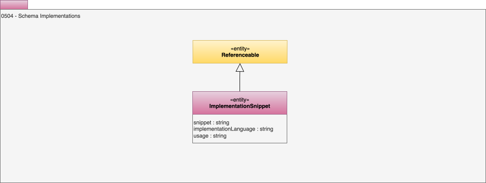

<!-- SPDX-License-Identifier: CC-BY-4.0 -->
<!-- Copyright Contributors to the ODPi Egeria project. -->

# 0504 Implementation Snippets

Developers can be aided in their work by having snippets of schema implementation that follow approved structures and naming conventions that they can include in their APIs and data structures.

## ImplementationSnippet entity

The *ImplementationSnippet* entity is for the storage of an implementation snippet, along with details of its language and version.  It inherits from [Referenceable](/types/0/0010-Base-Model) which means it can have a link to an [external reference](/types/0/0015-Linked-Media-Types) which could be, say, a physical schema implementation in a source code repository).

The additional attributes of an implementation snippet are:

* *snippet* - the implementation code.
* *implementationLanguage* - the programming/encoding language used for the snippet.  For example, JSON, XML, Java, ...
* *usage* - how should this snippet be used.

The snippet is linked to the element it represents using the [ImplementedBy](/types/7/0737-Solution-Implementation) relationship.

--8<-- "snippets/abbr.md"