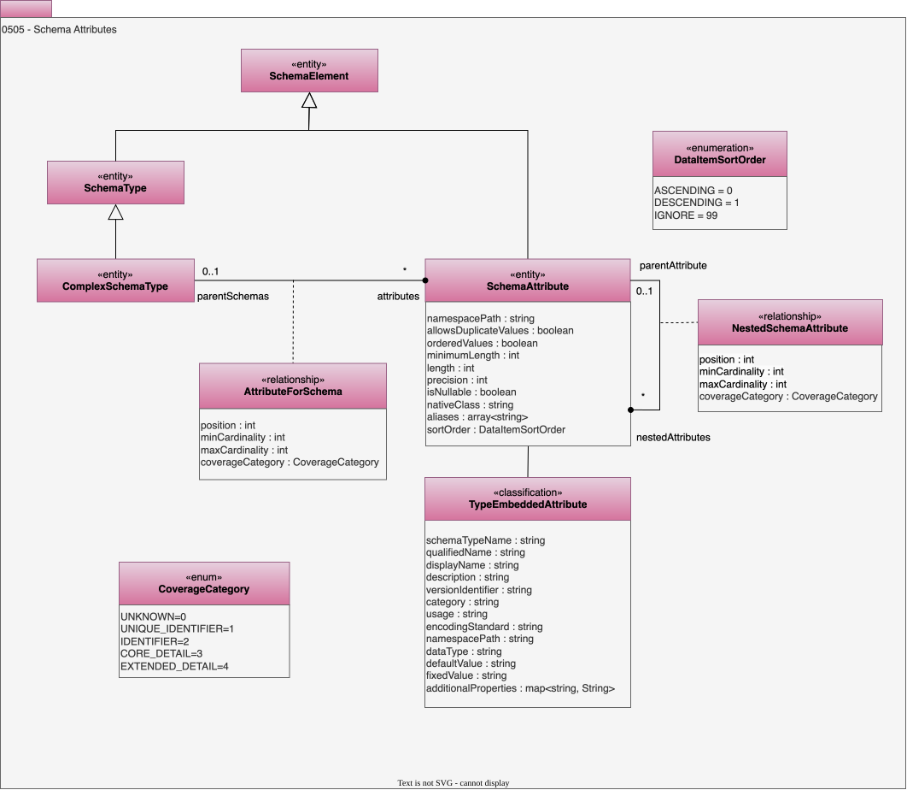

<!-- SPDX-License-Identifier: CC-BY-4.0 -->
<!-- Copyright Contributors to the ODPi Egeria project. -->

# 0505 Schema Attributes

[Schemas](/concepts/schema) typically have a hierarchical structure. Model 0505 provides for a structure of complex schema types that have their own internal structure. This structure is defined through one or more nested *schema attributes* each with their own type.

## TypeEmbeddedAttribute classification

The *TypeEmbeddedAttribute* classification is applied directly to the *SchemaAttribute* to provide its type information. For example, if a ComplexSchemaType has a simple string attribute this can be captured as a SchemaAttribute (giving the name of the attribute) with a TypeEmbeddedAttribute classification (whose `dataType` property indicates `string`).

TypeEmbeddedAttribute can represent any of the standard schema types. Where a schema type is described using multiple schema type objects,(such as [MapSchemaType](/types/5/0511-Map-Schema-Elements), [SchemaOptionChoice](/types/5/0501-Schema-Elements) and [ExternalSchemaType](/types/5/0507-External-Schema-Type)) the schema relationships for that type begin with *SchemaElement* and then map to more detailed SchemaTypes. This is so they can be connected to a SchemaAttribute or a SchemaType.

* *encodingStandard* - Format of the schema.
* *dataType* - The name of a primitive data type.
* *schemaTypeName* - Open metadata type name for the associated schema type.
* *qualifiedName* - Unique name for the element.
* *displayName* - Display name of the element used for summary tables and titles.
* *description* - Description of the element or associated resource in free-text.
* *defaultValue* - Value that is used when an instance of the data field is created.
* *fixedValue* - The value of a literal data type.
* *usage* - Guidance on how the element should be used.
* *additionalProperties* - Additional properties for the element.

* *category* - Descriptive name of the concept that this element applies to.
* *namespacePath* - Prefix for element names to ensure uniqueness.
* *versionIdentifier* - Version identifier to allow different versions of the same resource to appear in the catalog as separate assets.

## NestedSchemaAttribute relationship

A *SchemaAttribute* can be nested within another *SchemaAttribute* using the *NestedSchemaAttribute* relationship. See [0534 Relational Schemas](/types/5/0534-Relational-Schemas) for an example of this between RelationalTables and RelationalColumns.  The properties are:

* *position* - The position of the attribute in the parent schema attribute.  Zero (0) means no position and a positive number identifies the position of the nested schema attribute.
* *minCardinality* - The minimum number of occurrences of the nested schema attribute in the parent schema.
* *maxCardinality* - The maximum number of occurrences of the nested schema attribute in the parent schema.  A negative number means "many".

* *coverageCategory* - Used to describe how a collection of data values for an attribute covers the domain of the possible values to the linked attribute.

## DataItemSortOrder enum

*DataItemSortOrder* provides the valid values for the *sortOrder* property of SchemaAttribute.  It indicates whether the rows/instances of the data stored in this schema appear in any particular order or not.

| Enumeration | Value | Name           | Description                                                                     |
|-------------|-------|----------------|------------------------------------------------------------------------------------------------|
| UNKNOWN     | 0     | "<Unknown>"    | The sort order is not specified. |
| ASCENDING   | 1     | "Ascending"    | The attribute instances are organized so that the smallest/lowest value is first and the rest of the instances follow in ascending order. |
| DESCENDING  | 2     | "Descending"   | The attribute instances are organized so that the largest/highest value is first and the rest of the instances follow in descending order. |
| UNSORTED    | 3     | "Unsorted"     | The instances of the schema attribute may appear in any order. |

## ComplexSchemaType entity

A schema type that has a complex structure of nested attributes and types.

## SchemaAttribute entity

A schema element that nests another schema type in its parent.

* *allowsDuplicateValues* - When multiple occurrences are allowed, indicates whether duplicates of the same value are allowed or not.
* *orderedValues* - When multiple occurrences are allowed, indicates whether the values are ordered or not.
* *nativeClass* - Native class used by the client to represent this element.
* *aliases* - List of alternative names.
* *sortOrder* - Defines the suggested order that data values in this data item should be sorted by.
* *minimumLength* - Minimum length of the data value (zero means unlimited).
* *length* - Length of the data field (zero means unlimited).
* *isNullable* - Accepts null values or not.
* *precision* - Number of digits after the decimal point.
* *namespacePath* - Prefix for element names to ensure uniqueness.

## AttributeForSchema relationship

Link between a complex schema type and its attributes.

* *position* - Position of the element in a collection of relationships. Zero means no position set. A positive value identified the position starting from 1 for the first position.
* *minCardinality* - Minimum number of allowed instances.
* *maxCardinality* - Maximum number of allowed instances.
* *coverageCategory* - Used to describe how a collection of data values for an attribute covers the domain of the possible values to the linked attribute.
                                                                            

--8<-- "snippets/abbr.md"