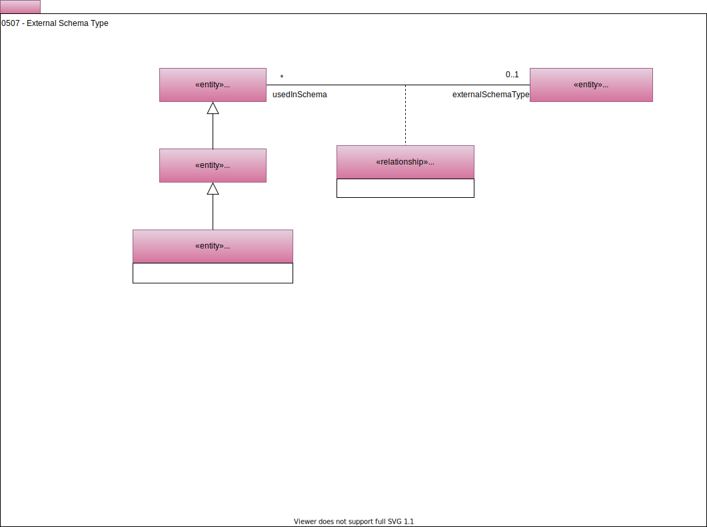

<!-- SPDX-License-Identifier: CC-BY-4.0 -->
<!-- Copyright Contributors to the ODPi Egeria project. -->

# 0507 External Schema Type

External schema types allow an [asset's schema](/types/5/0503-Asset-Schema) to reference another schema types defined outside the scope of the asset.

## ExternalSchemaType

The *ExternalSchemaType* is part of the asset's schema type.

## LinkedExternalSchemaType

The schema type that is linked to via the *LinkedExternalSchemaType* relationship is often defined as part of a standard, or a set of types supported by a specific type of technology. It is typically reused in asset schemas when the asset is supporting a standard.  It may also be used as types for schema attributes where the schema is defined for a specific technology that has a fixed set of types. For example, a relational database column may be defined with external types that represent the defined types of the database platform where the database schema resides.

The *LinkedExternalSchemaType* is linked from a [*SchemaElement*](/types/5/0501-Schema-Elements) to enable it to be used either by a *SchemaType* or a *SchemaAttribute* that has its schema type defined in the [*TypeEmbeddedAttribute*](/types/5/0505-Schema-Attributes) classification.

??? deprecated "Deprecated types"
    The following types are replaced by the attributes in [SchemaAttribute](/type/5/0505-Schema-Attributes).
    - *BoundedSchemaType*
    - *BoundedSchemaElementType*
    - *ArraySchemaType*
    - *SetSchemaType*

--8<-- "snippets/abbr.md"