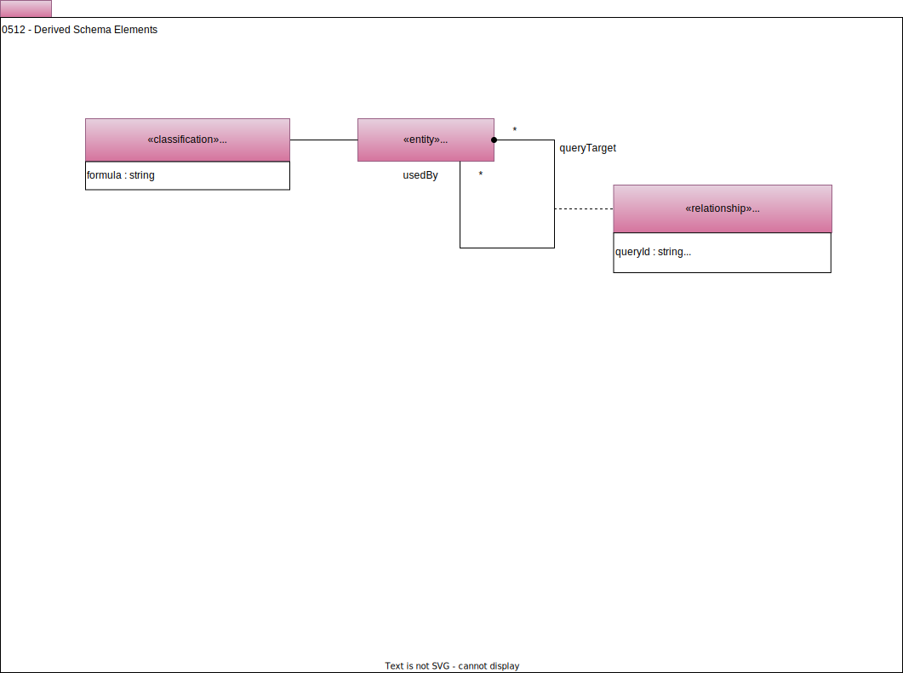

---
hide:
- toc
---

<!-- SPDX-License-Identifier: CC-BY-4.0 -->
<!-- Copyright Contributors to the ODPi Egeria project. -->

# 0512 Derived Schema Elements

Derived schema elements access other data, possibly in the same or a different asset to generate/derive the values for the attribute.  Examples of this are [database views](/types/5/0534-Relational-Schemas) and [derived database columns]((/types/5/0534-Relational-Schemas)).

## CalculatedValue classification

The *CalculatedValue* classification contains the *formula* attribute which is set to the query that retrieves the data, *formulaType* describes the notation language used to describe the formula.  There are optional links to *DerivedSchemaTypeQueryTarget* to identify which schema elements are accessed by the formula. The formula may contain placeholders that refer to the *queryId* in *DerivedSchemaTypeQueryTarget*.  Alternatively, the query can be expressed complement using the *query* and *queryType* attributes.

## DerivedSchemaTypeQueryTarget relationship

The *DerivedSchemaTypeQueryTarget* relationship identifies the schema elements that are queried to generate all or part of the value for the attribute at end 1.

--8<-- "snippets/abbr.md"