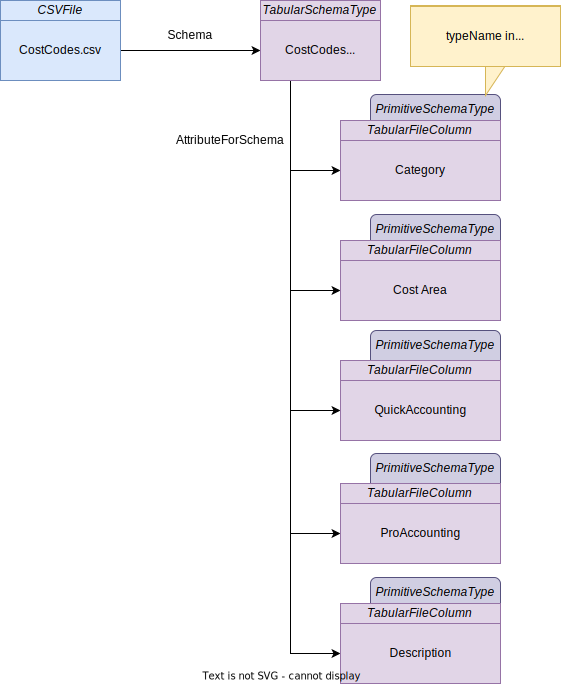

<!-- SPDX-License-Identifier: CC-BY-4.0 -->
<!-- Copyright Contributors to the ODPi Egeria project. -->

# 0530 Tabular Schemas

The 053x models cover specialized types that represent the popular technologies.  These types inherit from common schema element types:

* [SchemaAttribute](/types/5/0505-Schema-Attributes) - this is the place where the data is stored.
* [SchemaType](/types/5/0501-Schema-Elements) - ths is the type of the data - typically defining what values can be stored and how they are structured/formatted.  For example, the schema type may be a primitive value ([PrimitiveSchemaType](/types/5/0501-Schema-Elements)) or a structure ([ComplexSchemaType](/types/5/0505-Schema-Attributes)).

## TabularSchemaType

*TabularSchemaType* is an example of a *RootSchemaType* that describes the structure of an asset that is a single table of data.
For example, this could be a file that is organized into columns such as in a [CSV file](/types/2/0220-Files-and-Folders) or spreadsheet.

The image above shows the content of a CSV file called `CostCodes.csv`.  It is catalogued using a [*CSVFile*](/types/2/0220-Files-and-Folders) asset entity.  Linking from it using the [*Schema*](/types/5/0503-Asset-Schema) relationship would be a *TabularSchemaType* entity describing the structure of the data in the file.

## TabularColumn

A *TabularColumn* entity is used to describe one of the columns in a tabular schema.  It is linked to the *TabularSchemaType* entity using the [*AttributeForSchema*](/types/5/0505-Schema-Attributes) relationship.   The type information for each column is directly embedded on the *TabularColumn* entity through the [TypeEmbeddedAttribute](/types/5/0505-Schema-Attributes) classification.

## TabularFileColumn

A *TabularFileColumn* is a specialization of *TabularColumn* to enable a column in a file to have a distinctive subtype from a column in a database - represented by [RelationalColumn](/types/5/0534-Relational-Schemas).

!!! info "Further Information"

    * [Relational database columns](/types/5/0534-Relational-Schemas) are specializations of the tabular schema.

??? deprecated "Deprecated types"
    The **TabularColumnType** entity has been deprecated because it restricts tabular columns to primitive types and some technologies will be able to support more types.

--8<-- "snippets/abbr.md"