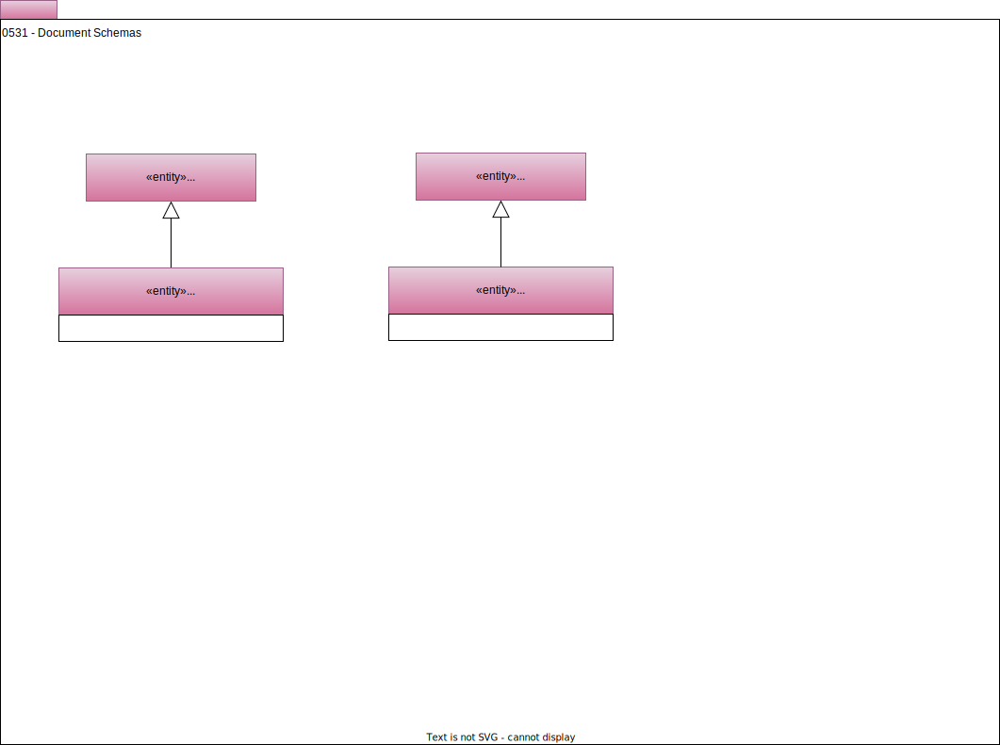

---
hide:
- toc
---

<!-- SPDX-License-Identifier: CC-BY-4.0 -->
<!-- Copyright Contributors to the ODPi Egeria project. -->

# 0531 Document Schemas

Model 0531 shows the definitions for describing the schema of structured documents such as JSON or XML.  They are typically attached to assets that are [files](/types/2/0220-Files-and-Folders) or [document stores](/types/2/0221-Document-Stores).

The root of the schema is represented by an entity of type *DocumentSchemaType*.  This would [link to the asset](/types/5/0503-Asset-Schema) that represents the document, or the [port where the document is passed to a process](/types/5/0520-Process-Schemas).

Each data field in the schema is represented by a *DocumentSchemaAttribute* entity.  

Note that the type information for each attribute within these structures can be directly embedded on the *DocumentSchemaAttribute* through the [TypeEmbeddedAttribute](/types/5/0505-Schema-Attributes) classification. Also
recall that the [NestedSchemaAttribute](0505-Schema-Attributes.md) relationship can be used to capture nested
(hierarchical) structures within such documents.

??? deprecated "Deprecated types"
    The **SimpleDocumentType**, **StructDocumentType**, **MapDocumentType**, **ArrayDocumentType**, and **SetDocumentType** types have been deprecated because they   offer little value since the type is typically stored in the **TypeEmbeddedAttribute** classification. This change makes the document schemas consistent with other types of schema.

--8<-- "snippets/abbr.md"
