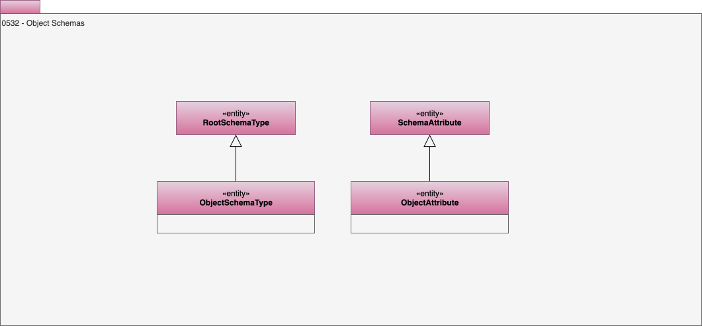

---
hide:
- toc
---

<!-- SPDX-License-Identifier: CC-BY-4.0 -->
<!-- Copyright Contributors to the ODPi Egeria project. -->

# 0532 Object Schemas

Model 0532 describes an object schema - such as the structure for a series of POJO Java objects.

## ObjectAttribute entity

An attribute in an object schema type.

## ObjectSchemaType entity

A schema root for an object.

--8<-- "snippets/abbr.md"