---
hide:
- toc
---

<!-- SPDX-License-Identifier: CC-BY-4.0 -->
<!-- Copyright Contributors to the ODPi Egeria project. -->

# 0533 Graph Schemas

Model 0533 describes the schema for a property graph.

## GraphEdge entity

A schema attribute for a relationship in graph data structure.

## GraphSchemaType entity

A schema type for a graph data structure.

## GraphVertex entity

A schema attribute for a node in a graph data structure.

## GraphEdgeLink relationship

A link between a graph edge and a vertex. Each edge should have two of these relationships.

* *linkTypeName* - Unique name of the link type that connects the edge to the vertex.
* *relationshipEnd* - If the end of a relationship is significant, set to 1 or 2 to indicated the desired end; otherwise use 0.
* *relationshipEndName* - Display name for the relationship end.
* *description* - Description of the element or associated resource in free-text.
* *minCardinality* - Minimum number of allowed instances.
* *maxCardinality* - Maximum number of allowed instances.
* *additionalProperties* - Additional properties for the element.

--8<-- "snippets/abbr.md"