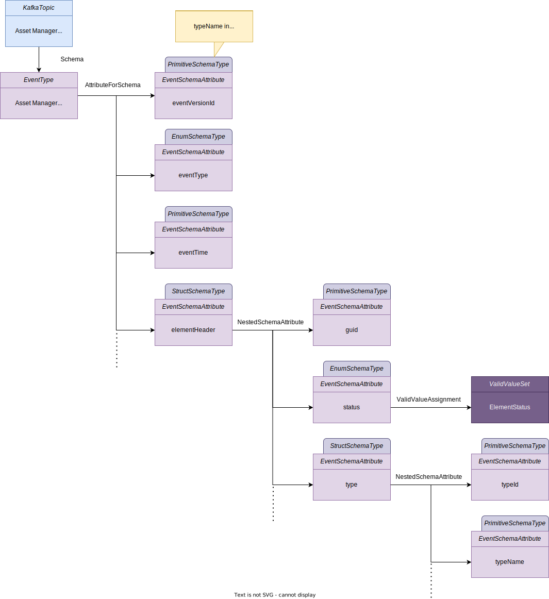
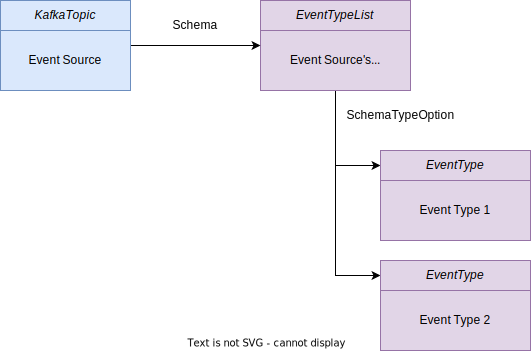
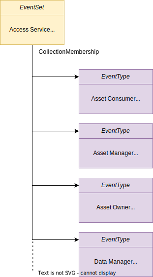
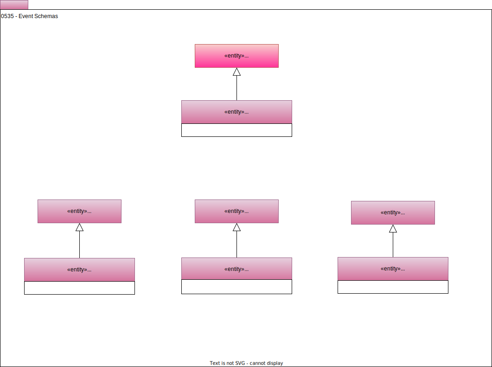

<!-- SPDX-License-Identifier: CC-BY-4.0 -->
<!-- Copyright Contributors to the ODPi Egeria project. -->

# 0535 Event Schemas

[Events](/concepts/basic-concepts/#event) capture the details of a specific situation or activity.  They are sent between services, often using an intermediary, such as an [Event Broker](/concepts/basic-concepts/#event-broker).  Event schemas provide the means to share the structure of the information flowing in the events.  They are typically attached to [*Topics*](/types/2/0223-Events-and-Logs).

## EventType

An event schema begins with an *EventType* entity at its root.  It is linked to the asset using the [*AssetSchemaType*](/types/5/0503-Asset-Schema) relationship.

The data fields in the event are represented using *EventSchemaAttribute* entities that are linked to the event type using the [*AttributeForSchema*](/types/5/0505-Schema-Attributes) relationship.

## EventSchemaAttribute

*EventSchemaAttribute* describes a data field or structure in an event schema.  The data type of the data field is stored in an attached [*TypeEmbeddedAttribute*](/types/5/0505-Schema-Attributes) classification.  If the data field is a structure, the *typeName* property in *TypeEmbeddedAttribute* is set to `StructSchemaType` and the nested data fields, represented by their own *EventSchemaAttribute* entities, are linked via the [*NestedSchemaAttribute*](/types/5/0505-Schema-Attributes) relationship.

Below is an example of a JSON event from the [Asset Manager OMAS](/services/omas/asset-manager/overview).  It has a nested structure and this is reflected in the schema structure.

??? example "Example JSON Event"
    ```json
    {
      "eventVersionId": 1,
      "eventType": "NEW_ELEMENT_CREATED",
      "eventTime": "date/time",
      "elementHeader": {
        "guid": "unique identifier",
        "status": "ACTIVE",
        "type": {
          "typeId": "unique identifier",
          "typeName": "name of type - eg Database",
          "superTypeNames": [
            "name of super type",
            "name of super super type etc"
          ],
          "typeVersion": 1,
          "typeDescription": "text"
        },
        "origin": {
          "sourceServer": "mds1",
          "originCategory": "LOCAL_COHORT",
          "homeMetadataCollectionId": "unique identifier",
          "homeMetadataCollectionName": "name",
          "license": "license description if any"
        },
        "versions": {
          "createdBy": "user",
          "updatedBy": "user",
          "maintainedBy": [
            "user",
            "user"
          ],
          "createTime": "date/time",
          "updateTime": "date/time",
          "version": 4
        },
        "classifications": [
          {
            "classificationName": "name",
            "classificationProperties": {
              "propertyName1": "propertyValue1",
              "propertyName2": "propertyValue2"
            }
          }
        ]
      },
      "elementProperties": {
        "propertyName1": "propertyValue1",
        "propertyName2": "propertyValue2"
      },
      "previousElementHeader": {
        "guid": "unique identifier",
        "status": "ACTIVE",
        "type": {
          "typeId": "unique identifier",
          "typeName": "name of type - eg Database",
          "superTypeNames": [
            "name of super type",
            "name of super super type etc"
          ],
          "typeVersion": 1,
          "typeDescription": "text"
        },
        "origin": {
          "sourceServer": "mds1",
          "originCategory": "LOCAL_COHORT",
          "homeMetadataCollectionId": "unique identifier",
          "homeMetadataCollectionName": "name",
          "license": "license description if any"
        },
        "versions": {
          "createdBy": "user",
          "updatedBy": "user",
          "maintainedBy": [
            "user",
            "user"
          ],
          "createTime": "date/time",
          "updateTime": "date/time",
          "version": 4
        },
        "classifications": [
          {
            "classificationName": "name",
            "classificationProperties": {
              "propertyName1": "propertyValue1",
              "propertyName2": "propertyValue2"
            }
          }
        ]
      },
      "previousElementProperties": {
        "propertyName1": "propertyValue1",
        "propertyName2": "propertyValue2"
      },
      "classificationName": "name",
      "previousClassificationProperties": {
        "propertyName1": "propertyValue1",
        "propertyName2": "propertyValue2"
      },
      "endOneElementHeader": {
        "guid": "unique identifier",
        "status": "ACTIVE",
        "type": {
          "typeId": "unique identifier",
          "typeName": "name of type - eg Database",
          "superTypeNames": [
            "name of super type",
            "name of super super type etc"
          ],
          "typeVersion": 1,
          "typeDescription": "text"
        },
        "origin": {
          "sourceServer": "mds1",
          "originCategory": "LOCAL_COHORT",
          "homeMetadataCollectionId": "unique identifier",
          "homeMetadataCollectionName": "name",
          "license": "license description if any"
        },
        "versions": {
          "createdBy": "user",
          "updatedBy": "user",
          "maintainedBy": [
            "user",
            "user"
          ],
          "createTime": "date/time",
          "updateTime": "date/time",
          "version": 4
        },
        "classifications": [
          {
            "classificationName": "name",
            "classificationProperties": {
              "propertyName1": "propertyValue1",
              "propertyName2": "propertyValue2"
            }
          }
        ]
      },
      "endOneElementProperties": {
        "propertyName1": "propertyValue1",
        "propertyName2": "propertyValue2"
      },
      "endTwoElementHeader": {
        "guid": "unique identifier",
        "status": "ACTIVE",
        "type": {
          "typeId": "unique identifier",
          "typeName": "name of type - eg Database",
          "superTypeNames": [
            "name of super type",
            "name of super super type etc"
          ],
          "typeVersion": 1,
          "typeDescription": "text"
        },
        "origin": {
          "sourceServer": "mds1",
          "originCategory": "LOCAL_COHORT",
          "homeMetadataCollectionId": "unique identifier",
          "homeMetadataCollectionName": "name",
          "license": "license description if any"
        },
        "versions": {
          "createdBy": "user",
          "updatedBy": "user",
          "maintainedBy": [
            "user",
            "user"
          ],
          "createTime": "date/time",
          "updateTime": "date/time",
          "version": 4
        },
        "classifications": [
          {
            "classificationName": "name",
            "classificationProperties": {
              "propertyName1": "propertyValue1",
              "propertyName2": "propertyValue2"
            }
          }
        ]
      },
      "endTwoElementProperties": {
        "propertyName1": "propertyValue1",
        "propertyName2": "propertyValue2"
      }
    }
    ```

Asset Manager OMAS only supports one event structure so its event type is linked directly to the topic asset using the *AssetSchemaType* relationship.  The list of data fields in the event are represented by *EventAttributeSchema* and linked to the event type using the *AttributeForSchema* relationship.  Data fields such as the *elementHeader* have a type of *StructSchemaType* and its subfields are *EventSchemaAttributes* linked to their parent by the *NestedSchemaAttribute* relationship.

In the example below, *EventTypeList* is linked to the asset (*KafkaTopic* in this case) via the *AssetSchemaType* relationship and the event types represent each event option.  The *EventType* entities are linked to the *EventTypeList* using the *SchemaTypeOption* relationship.



## EventTypeList

*EventTypeList* provides an entity that holds a list of event types.  It is used for an asset that produces events of different types.



## EventSet

*EventSet* provides a specialized [*Collection*](/types/0/0021-Collections) to gather a collection of event schema definitions that are related.  The event schemas are represented by the *EventType* entity and linked to the *EventSet* using the *CollectionMembership* relationship.


> An example of an event set showing the event types used in the Open Metadata Access Services (OMAS) Out Topics.

## UML Summary





--8<-- "snippets/abbr.md"