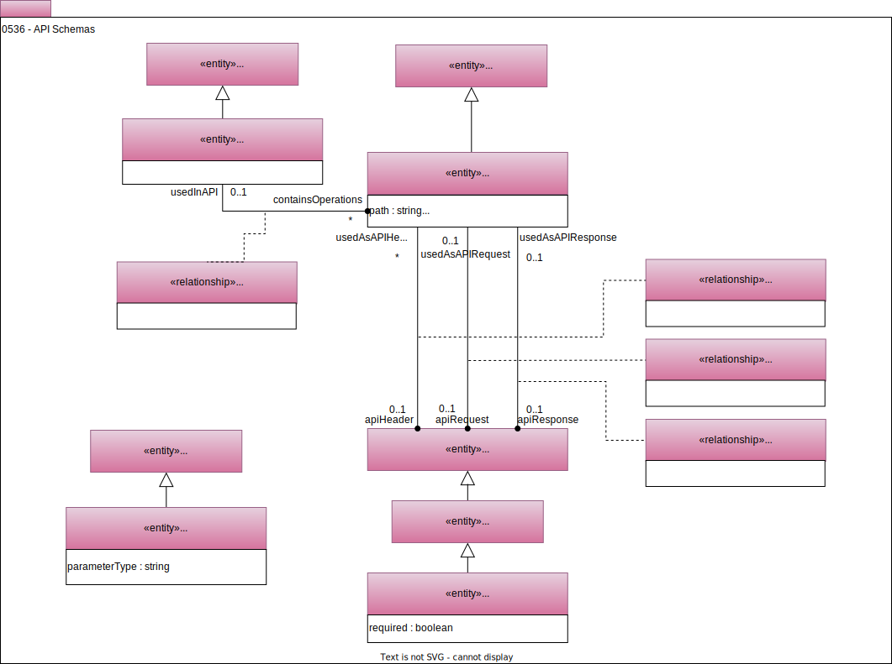
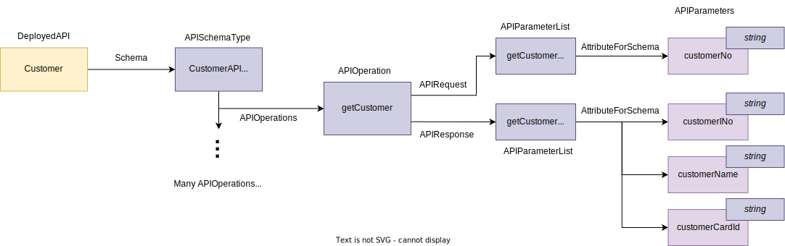

<!-- SPDX-License-Identifier: CC-BY-4.0 -->
<!-- Copyright Contributors to the ODPi Egeria project. -->

# 0536 API Schemas

The schema of a [deployed API](/types/2/0212-Deployed-APIs) is its interface definition.  The open metadata types for an API's schema were influenced by the [OpenAPI Specification](https://en.wikipedia.org/wiki/OpenAPI_Specification) standard.

Model 0536 shows the structure of an API schema.
The top level schema for the API lists the operations.
Under that, each operation defines its requests and responses.

## APISchemaType

The *APISchemaType* entity provides the [RootSchemaType](/types/5/0530-Tqbular-Schemas) for the API's schema.

## APIOperations

The *APIOperations* relationship links the *APISchemaType* entity to one of its operations, represented by the *APIOperation* entity.

## APIOperation

The *APIOperation* entity represents a single operation (also known as a method, or function).  If this is a ReSt API, set the *pathName* variable to the path of the operation.  Add the name of the operation/function/method to the *command* attribute.

## APIHeader

Some operations include header information that supplied runtime information such as security tokens or debug levels. The structure of the supported header information can be documented in a [SchemaType](/types/5/0501-Schema-Elements) that is linked to the *APIOperation* entity via the *APIHeader* relationship.

## APIRequest

The structure of the request parameters for an operation can be documented in a [SchemaType](/types/5/0501-Schema-Elements) that is linked to the *APIOperation* entity via the *APIRequest* relationship.  Typically, the type of the request parameters is *APIParameterList*.

## APIResponse

The structure of the response (results) of an operation can be documented in a [SchemaType](/types/5/0501-Schema-Elements) that is linked to the *APIOperation* entity via the *APIResponse* relationship.

## APIParameterList

The *APIParameterList* entity is a specialized [ComplexSchemaType](/types/5/0505-Schema-Attributes) that allows a list of parameters to be defined.

## APIParameter

The *APIParameter* entity is a specialized [SchemaAttribute](/types/5/0505-Schema-Attributes) that indicates that the parameter is part of an API.  It helps consumers of the metadata to understand the difference between, for example, ta data element send on an API from a [database column](/types/5/0534-Relational-Schemas/#relationalcolumn) stored in a database.

## Example API Schema

Here is an example of an API schema called *CustomerAPI Specification*.  It shows one API operation called *getCustomer*.  This operation takes a *customerNo* string as an input parameter and returns *customerNo*, *customerName* and *customerCardId* strings in the response.

--8<-- "snippets/abbr.md"