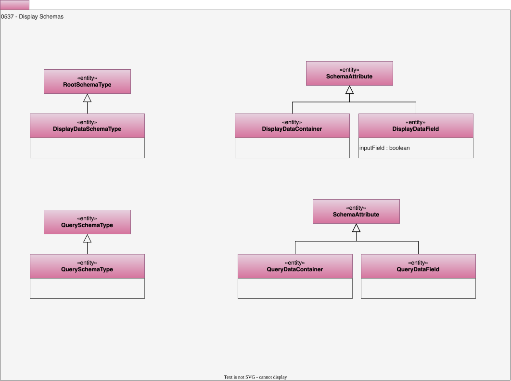

---
hide:
- toc
---

<!-- SPDX-License-Identifier: CC-BY-4.0 -->
<!-- Copyright Contributors to the ODPi Egeria project. -->

# 0537 Display Schemas

At some point data is assembled and displayed to an end user.

Model 0537 shows the structure of data that is displayed to end users
either in reports or forms.

## DisplayDataContainer entity

A grouping of display data fields (and nested containers) for a report, form or similar data display asset.

## DisplayDataField entity

A data display field.

* *inputField* - Is this data field accepting new data from the end user or not.

## DisplayDataSchemaType entity

A structure describing data that is to be displayed.

## QueryDataContainer entity

A grouping of display data fields (and nested containers) for a query.

## QueryDataField entity

A data field that is returned by a query.

## QuerySchemaType entity

A structure describing data that being queried and formatted to support a user display or report.

--8<-- "snippets/abbr.md"