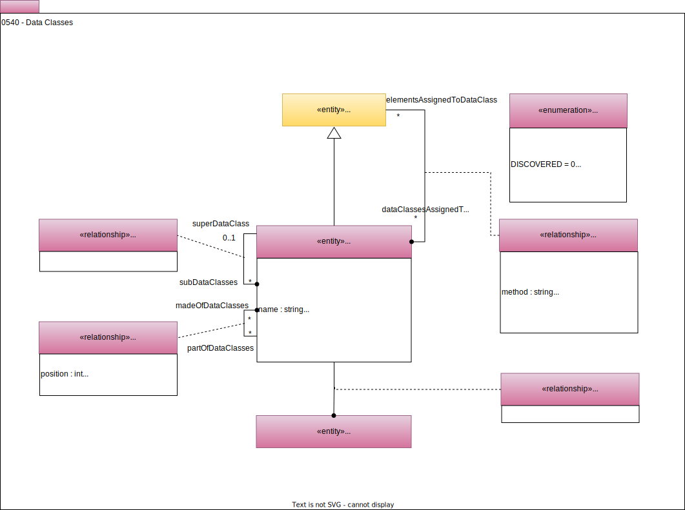

<!-- SPDX-License-Identifier: CC-BY-4.0 -->
<!-- Copyright Contributors to the ODPi Egeria project. -->

# 0540 Data Classes

Data classes describe logical data types that can be used to classify data values in a consistent and standardized way.  They are particularly important in [data quality assessments](/features/data-quality/overview) and [metadata discovery](/features/discovery-and-stewardship/overview).

## DataClass entity

The *DataClass* entity provides the specification of a [logical data type](/concepts/data-class). This goes beyond the [*SchemaType*](/types/5/0501-Schema-Elements) used to store the data value and includes a specification of the values that are found in this logical type.  For example, a credit card number is typically stored as a string.  The fact that it is a string is described in the schema type.  However, it also has a well-defined pattern of four groups of four digits.  The data class allows the capture of the specification of a credit card number type that can be used by discovery engines to narrow down the expected data values within a [digital resource's](/concepts/digital-resource) data fields.

The data class is describing a set of data values found in a data field of a digital resource.  For example, the data values stored in a particular column of a database table.  When an automated process uses the data class, it assesses each of the data values it finds against the definition of the data class and determines the percentage of values that match the specification.  The *matchThreshold* determines what percentage of values must match to consider the data to be of the type described in the data class.  This discovered percentage can also be used as a confidence level or quality score.

In addition to inheriting from [Referenceable](/types/0/0010-Base-Model), the attributes for a data class are:

* *displayName* - Name to use in reports and displays.
* *description* - Description of the purpose and function of the data class.
* *namespace* - Namespace that the data class is organized under.
* *matchPropertyNames* - List of property names that are filled out in this data class.  This helps automation to locate the type of data values that this data class supports/represents.
* *matchThreshold* - The percentage of data values in the data resource that need to match to be assigned to this data class.
* *specification* - A specification of the matching data values.  This can be machine or human-readable.  This attribute allows a rules language to be used to describe the data class's values.  So it may be the rule explicitly stated, or the name of a rule.
* *specificationDetails* - Adds additional values to the specification - for example, they may be substitution values to insert in to the specification string.
* *dataType* - Name of the data type used to encode this type of data - for example, string, int, char, ...
* *allowsDuplicateValues* - Indicates whether the values in the data resource may repeat, or whether this is a list of unique identifiers/values.
* *isNullable* - Are null values allowed?
* *defaultValue* - Value that is used when an instance of the data field is created, or if it is null.
* *averageValue* - Expected average value of the data values.  This can help assess whether the data values are in the normal range.
* *valueList* - Defines a list of valid values for the data.  If the list of values are long, need special curation or are used more broadly, they can be described using a *ValidValuesSet* and linked to the data class using the *ValidValuesAssignment* relationship.  See [model 0545 - Reference Data](/types/5/0545-Reference-Data).
* *valueRangeFrom*  and *valueRangeTo* - Allow the definition of a range of valid values for the data field.
* *sampleValues* - List of sample values for the data field.  This helps people select an appropriate data class.
* *dataPatterns* - Regular expressions that characterize the values in the data field.

## DataClassHierarchy relationship

Data classes can be organized into a hierarchy using the *DataClassHierarchy* relationship where more general data classes, such as *date* are at the top and underneath it are more specialized classes such as *date of birth*.  This means that discovery and stewardship processes can use the data class to hone in on the most specific logical data type for a data field and consequently run the most appropriate data quality rules on the data field's values.  This hierarchy can also be used when generating software artifacts, such as *Open API Specifications*, *Database Definition Language (DDL)* scripts or *JSON schema*.  If ia field is assigned a data class that is not present in the target programming language, the generator can navigate up the data class hierarchy to the more general type that is supported in the target language.

## DataClassComposition relationship

Data classes can be organized into a structural hierarchy using the *DataClassComposition* relationship.  For example, an address data class could be composed of a number of data classes that each describe a part of the address.  The properties in this relationship show how the fields are arranged.

## DataClassDefinition relationship

Data classes can be used to augment the definition of a [DataStructure](/types/5/0580-Data-Dictionaries) or [DataField](/types/5/0580-Data-Dictionaries) to make it easy to automated processes to identify the data class to use for an analysis.

## DataClassAssignment relationship

Data classes can be assigned to elements (typically [*SchemaAttributes*](/types/5/0505-Schema-Attributes)) to show that the data stored in the data field represented by the element conforms to the type.  A [survey action service](/concepts/survey-action-service) can propose a list of data class assignments and these are stored in the [*DataClassAnnotation*](/type/6/0625-Data-Class-Discovery).  Subsequent stewardship - either automated or with human assistance - can confirm the correct assignment using the *DataClassAssignment* relationship.

## DataDefinitionAssignmentStatus enumeration

The *DataDefinitionAssignmentStatus* enumeration is used to describe the status of the assignment of a data definition, such as a data class, or a [data grain](/types/5/0541-Data-Grains), to a data asset.

--8<-- "snippets/abbr.md"

