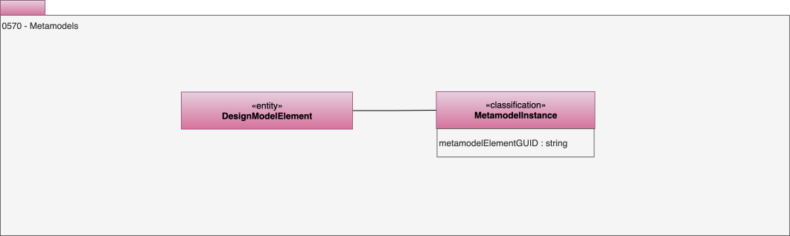

---
hide:
- toc
---

<!-- SPDX-License-Identifier: CC-BY-4.0 -->
<!-- Copyright Contributors to the ODPi Egeria project. -->

# 0570 Metamodels

A metadata model is a [design model](/types/5/0565-Design-Models) that describes the structure of another, specific type of model.  It defines the types of elements to expect and their relationships.

For example, in the open metadata ecosystem, the open metadata types are the metamodel for the metadata instances stored in the repository.   

## MetamodelInstance classification

The *MetamodelInstance* classification indicates which element in the metamodel is this metamodel element mapped to.  It is typically attached to metadata elements that describe metadata from a third party system.   It is used to understand how the metadata from the third party system has been mapped to the open metadata types.

* *metamodelElementGUID* supplies the GUID of the element from the metamodel.  This is typically a element of type [DesignModelElement](/types/5/0565-Design-Models) that identifies the type of third party equivalent element that this instance refers to. 

--8<-- "snippets/abbr.md"