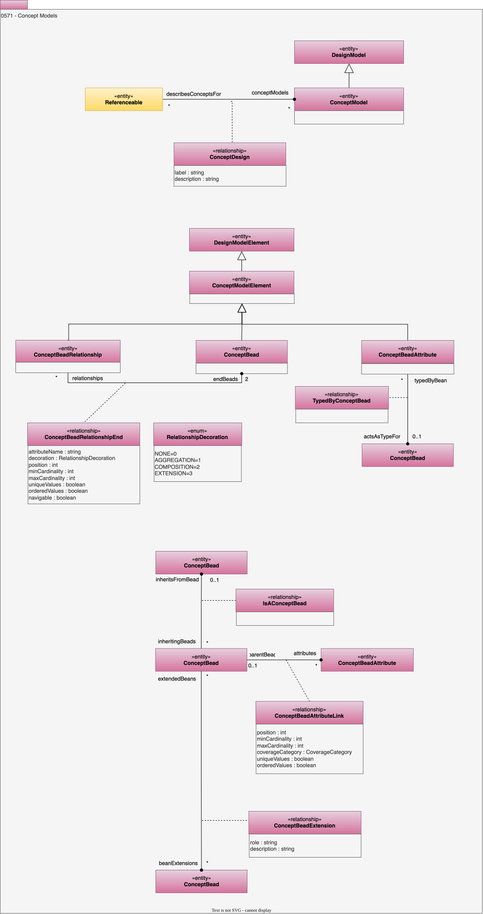

---
hide:
- toc
---

<!-- SPDX-License-Identifier: CC-BY-4.0 -->
<!-- Copyright Contributors to the ODPi Egeria project. -->

# 0571 Concept Models

Concept Models describe the core concepts for data oriented models.
Concept models are defined as a specialized of the concept model element
and there are three main subtypes:

* ConceptBead - an entity structure for a concept in a data-oriented model.
* ConceptBeadAttribute - an attribute of the concept bead.
* ConceptBead link - a relationship between two concept beads.

## ConceptBead entity

An abstract, but well-formed representation of a person, place or object.

## ConceptBeadAttribute entity

An abstract, but well-formed fact about a concept bead.

## ConceptBeadRelationship entity

A relationship between concept beads.

## ConceptModel entity

A collection of concept model elements that describes the concepts for a design or implementation.

## ConceptModelElement entity

An abstract, but well-formed representation of a concept.

## ConceptBeadAttributeLink relationship

Links a concept bead to its attributes.

* *position* - Position of the element in a collection of relationships. Zero means no position set. A positive value identified the position starting from 1 for the first position.
* *minCardinality* - Minimum number of allowed instances.
* *maxCardinality* - Maximum number of allowed instances.
* *coverageCategory* - Used to describe how a collection of data values for an attribute covers the domain of the possible values to the linked attribute.
* *uniqueValues* - When multiple occurrences are allowed, indicates whether duplicates of the same value are allowed or not.
* *orderedValues* - When multiple occurrences are allowed, indicates whether the values are ordered or not.

## ConceptBeadExtension relationship

Links a concept bead to another concept bead that provides attributes that are only valid in certain situations.

* *role* - Role that this artifact plays in implementing the abstract representation.
* *description* - Description of the element or associated resource in free-text.

## ConceptBeadRelationshipEnd relationship

Links one end of a concept bead link relationship to a concept bead.

* *attributeName* - The name of the attribute that the reference data assignment represents.
* *decoration* - Usage and lifecycle for this connection between the concept bead and the link.
* *position* - Position of the element in a collection of relationships. Zero means no position set. A positive value identified the position starting from 1 for the first position.
* *minCardinality* - Minimum number of allowed instances.
* *maxCardinality* - Maximum number of allowed instances.
* *uniqueValues* - When multiple occurrences are allowed, indicates whether duplicates of the same value are allowed or not.
* *orderedValues* - When multiple occurrences are allowed, indicates whether the values are ordered or not.
* *navigable* - Is it possible to follow the link in this direction.

## ConceptDesign relationship

Links an element to its concept model.

## IsAConceptBead relationship

Creates an inheritance relationship between 2 concept beads.

## TypedByConceptBead relationship

Links a concept bead to another concept bean that describes its type - this is where the type is complex, such as Address.

--8<-- "snippets/abbr.md"