---
hide:
- toc
---

<!-- SPDX-License-Identifier: CC-BY-4.0 -->
<!-- Copyright Contributors to the ODPi Egeria project. -->

# 0581 Data Field Implementation

These types allow more complex linkage of data fields and details of the data class that describes its content and the schema attribute that can be used when generating schemas.

## LinkedDataField relationship

Represents an association between two data fields in a schema. This may describe a full relationship in the schema (for example, in a relational schema) or a relationship end (for example, in a graph schema).

* *relationshipTypeName* - Type name of the potential relationship.
* *relationshipEnd* - If the end of a relationship is significant, set to 1 or 2 to indicated the desired end; otherwise use 0.
* *displayName* - Display name of the element used for summary tables and titles.
* *description* - Description of the element or associated resource in free-text.
* *minCardinality* - Minimum number of allowed instances.
* *maxCardinality* - Maximum number of allowed instances.
* *additionalProperties* - Additional properties for the element.

## NestedDataField relationship

Data field nested under a single parent data field.

* *coverageCategory* - Used to describe how a collection of data values for an attribute covers the domain of the possible values to the linked attribute.
* *position* - Position of the element in a collection of relationships. Zero means no position set. A positive value identified the position starting from 1 for the first position.
* *minCardinality* - Minimum number of allowed instances.
* *maxCardinality* - Maximum number of allowed instances.

## SchemaAttributeDefinition relationship

Link between a data field and the identified schema attribute definition.

## SchemaTypeDefinition relationship

Link between a data structure and an equivalent schema type.

--8<-- "snippets/abbr.md"