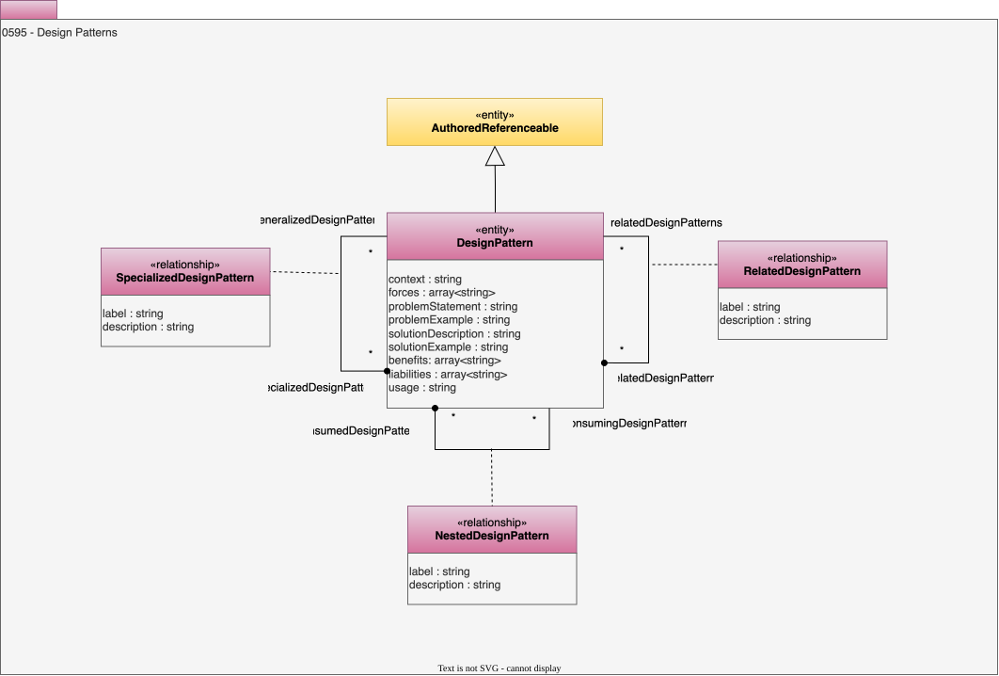

---
hide:
- toc
---

<!-- SPDX-License-Identifier: CC-BY-4.0 -->
<!-- Copyright Contributors to the ODPi Egeria project. -->

# 0595 Design Patterns

Design patterns document proven approaches to solving well known problems.

## DesignPattern entity

A description of a common solution with details of the problems it solves and its pros and cons.

* *context* - Description of the situation where this pattern may be useful.
* *forces* - Description of the aspects of the situation that make the problem hard to solve.
* *problemStatement* - Description of the types of problem that this design pattern provides a solution to.
* *problemExample* - One or more examples of the problem and its consequences.
* *solutionDescription* - Description of how the solution works.
* *solutionExample* - Illustrations of how the solution resolves the problem examples.
* *benefits* - The positive outcomes from using this pattern.
* *liabilities* - The additional issues that need to be considered when using this pattern.
* *usage* - Guidance on how the element should be used.

## NestedDesignPattern relationship

Links a design pattern to elements in its solution that are also design patterns.

* *label* - Display label to use when displaying this lineage relationship in a lineage graph.
* *description* - Description of the element or associated resource in free-text.

## RelatedDesignPattern relationship

Links design patterns together.

## SpecializedDesignPattern relationship

Links a design pattern to a specialized version of the pattern..

* *label* - Display label to use when displaying this lineage relationship in a lineage graph.
* *description* - Description of the element or associated resource in free-text.

--8<-- "snippets/abbr.md"