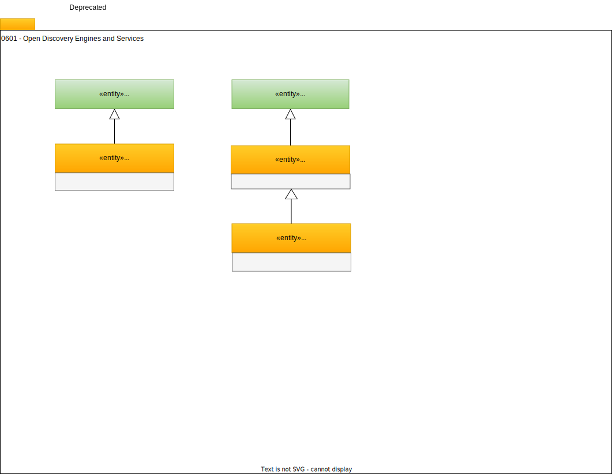

---
hide:
- toc
---

<!-- SPDX-License-Identifier: CC-BY-4.0 -->
<!-- Copyright Contributors to the ODPi Egeria project. -->

# 0601 Open Discovery Engines and Services

An *open discovery engine* executes *open discovery services* on request. Open discovery services are pluggable components that analyse data sources and document the results.

The `OpenDiscoveryEngine` entity creates a description of an instance of these types of engines. It is represented as a special type [`GovernanceEngine`](/types/4/0461-Governance-Engines) when it is documented in metadata.

A description of an open discovery engine is linked with a [`SupportedGovernanceService`](/types/4/0461-Governance-Engines) relationship to the description of an `OpenDiscoveryService` to indicate that
the open discovery engine supports the open discovery service.

The `OpenDiscoveryService` entity describes an implementation of an open discovery service.  This implementation is an specialized [OCF Connector](/concepts/connector). The `OpenDiscoveryService` entity is a subtype of [`Asset`](/types/0/0010-Base-Model) and is linked with a [`ConnectionToAsset`](/types/2/0205-Connection-Linkage) relationship to a [Connection](/types/2/0201-Connectors-and-Connections) entity that defines how to create an instance of the open discovery service in the Egeria OMAG Server Platform.

Open discovery pipelines are specialized open discovery services that execute multiple open discovery services in a single run.

The `OpenDiscoveryPipeline` entity describes an open discovery pipeline.  It is typically linked to a [VirtualConnection](/types/2/0205-Connection-Linkage) with the connections of the open discovery services embedded within it.

??? deprecated "Deprecated types"
    - **SupportedDiscoveryService** - Use [SupportedGovernanceService](/types/4/0461-Governance-Engines).
    
!!! education "Further information"
    - [Open Discovery and Stewardship](/features/discovery-and-stewardship/overview) describes how discovery works.
    - [Governance Engine Definition](/concepts/governance-engine-definition) creates the associations between the open discovery engine and its services.
    - [Writing Open Discovery Service](/guide/developer/open-discovery-servvices/overview) to build new discovery capability.

--8<-- "snippets/abbr.md"