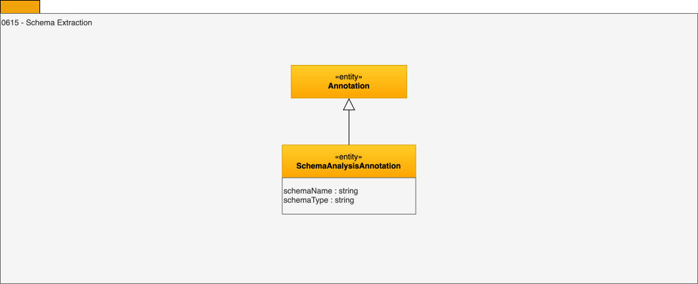

---
hide:
- toc
---

<!-- SPDX-License-Identifier: CC-BY-4.0 -->
<!-- Copyright Contributors to the ODPi Egeria project. -->

# 0615 Schema Extraction

Schema extraction creates a set of metadata entities that represent how the data is structured in the digital resource. 

This is then either matched with an existing schema or
a new schema is created (see [Area 5](/types/5)).
This may be completely automated, or with stewards assistance.

--8<-- "snippets/abbr.md"