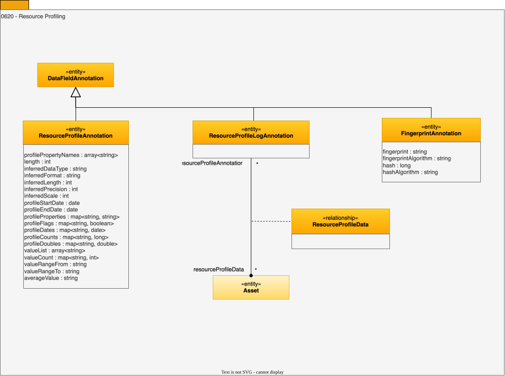

---
hide:
- toc
---

<!-- SPDX-License-Identifier: CC-BY-4.0 -->
<!-- Copyright Contributors to the ODPi Egeria project. -->

# 0620 Resource Profiling

Profiling analysis looks at the different aspects of the resource and summarizes their characteristics.

## FingerprintAnnotation entity

An annotation capturing digital resource fingerprint information.

* *fingerprint* - A string value that represents the content of the digital resource.
* *fingerprintAlgorithm* - The algorithm use to generate the fingerprint.
* *hash* - An long value that represents the content of the digital resource.
* *hashAlgorithm* - The algorithm use to generate the hash.

## ResourceProfileAnnotation entity

A collection of properties that characterize an aspect of a resource.

* *length* - Length of the data field (zero means unlimited).
* *inferredDataType* - Inferred data type based on the data values.
* *inferredFormat* - Inferred data format based on the data values.
* *inferredLength* - Inferred data field length based on the data values.
* *inferredPrecision* - Inferred precision of the data based on the data values.
* *inferredScale* - Inferred scale applied to the data based on the data values.
* *profileProperties* - Additional profile properties discovered during the analysis.
* *profileFlags* - Additional flags (booleans) discovered during the analysis.
* *profileCounts* - Additional counts discovered during the analysis.
* *valueList* - List of individual values in the data.
* *valueCount* - Count of individual values in the data.
* *valueRangeFrom* - Lowest value in the data.
* *valueRangeTo* - Highest value in the data.
* *averageValue* - Typical value in the data.
* *profileDoubles* - Additional large counts discovered during the analysis.
* *profileStartDate* - Time at which the profiling started collecting data.
* *profileEndDate* - Time at which the profiling stopped collecting data.
* *profileDates* - Relevant dates discovered during the analysis.
* *profilePropertyNames* - List of property names used in this annotation.

## ResourceProfileLogAnnotation entity

A link to a log file containing profile measures for a resource.

## ResourceProfileData relationship

Link to the external data resource containing the surveyed resource's profile data.

--8<-- "snippets/abbr.md"