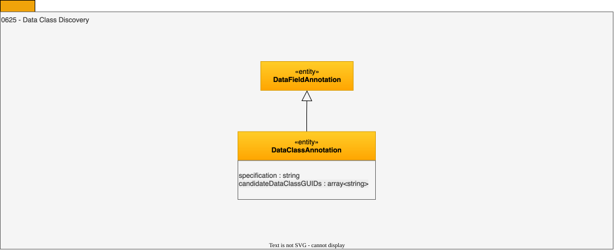

<!-- SPDX-License-Identifier: CC-BY-4.0 -->
<!-- Copyright Contributors to the ODPi Egeria project. -->

# 0625 Data Class Discovery

Data class discovery captures the analysis on how close the values in a data field matches the specification defined in a [data class](/concepts/data-class).

## DataClassAnnotation entity

This annotation records a possible data class match with the data analyzed by the survey action service.

* *candidateDataClassGUIDs* - List of possible matching data classes.
* *specification* - Name or explicit definition of rule used to identify values of this data class.

--8<-- "snippets/abbr.md"