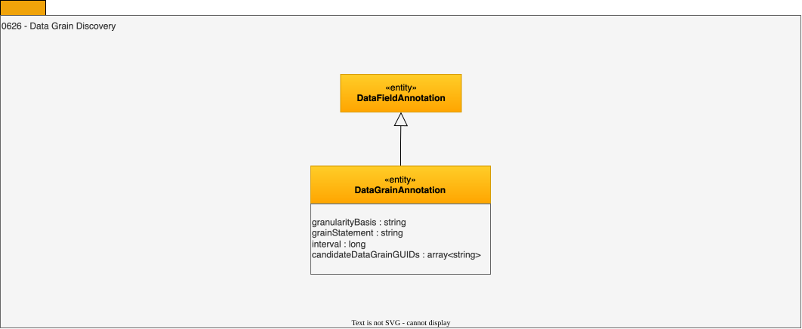

<!-- SPDX-License-Identifier: CC-BY-4.0 -->
<!-- Copyright Contributors to the ODPi Egeria project. -->

# 0626 Data Grain Discovery

Data grain discovery captures the analysis of the granularity of the values in a data field.  If may involve matching to the granularity specification defined in a [data grain](/concepts/data-grain).

## DataGrainAnnotation entity

This annotation records the analysis results into the granularity of the data, typically by comparing values in different rows of the same data field (column).  If data grain specifications are available, they can be listed in *candidateDataGrainGUIDs*.

* *candidateDataGrainGUIDs* - List of possible matching data grains.
* *granularityBasis* - The dimension or aspect of the data that controls its granularity.
* *grainStatement* - A statement describing the granularity of the data - typically expressed as the meaning of a row or object.
* *interval* - The interval that described the granularity of the data expressing in the units of the grain.

--8<-- "snippets/abbr.md"