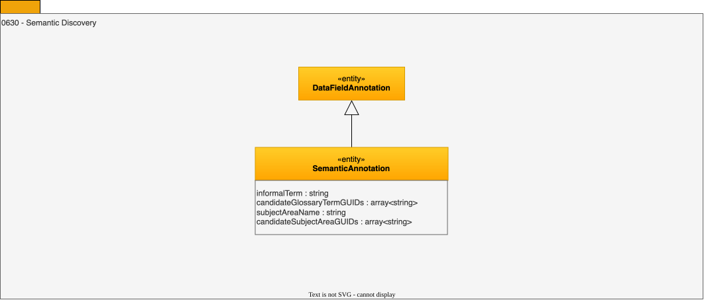

---
hide:
- toc
---

<!-- SPDX-License-Identifier: CC-BY-4.0 -->
<!-- Copyright Contributors to the ODPi Egeria project. -->

# 0630 Semantic Discovery

Semantic discovery is attempting to define the meaning of the data values in the resource. The result is one or more recommended glossary terms stored as an annotation.

## SemanticAnnotation entity

A recommendation of likely mappings to Glossary Terms for all or part of an Asset.

* *informalTerm* - Suggested term based on the analysis.
* *candidateGlossaryTermGUIDs* - List of potentially matching glossary terms.
* *subjectAreaName* - Identifier of the subject area.
* *candidateSubjectAreaGUIDs* - List of subject areas that contain potentially matching glossary terms.

--8<-- "snippets/abbr.md"