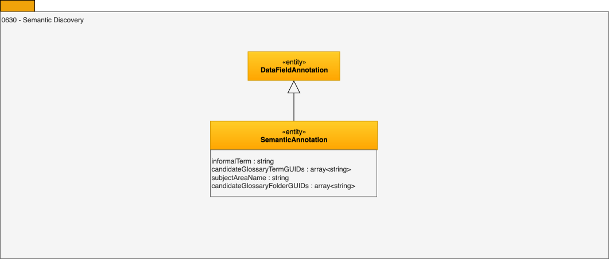

---
hide:
- toc
---

<!-- SPDX-License-Identifier: CC-BY-4.0 -->
<!-- Copyright Contributors to the ODPi Egeria project. -->

# 0630 Semantic Discovery

Semantic discovery is attempting to define the meaning of the data values in the resource. The result is one or more recommended glossary terms stored as an annotation.

--8<-- "snippets/abbr.md"