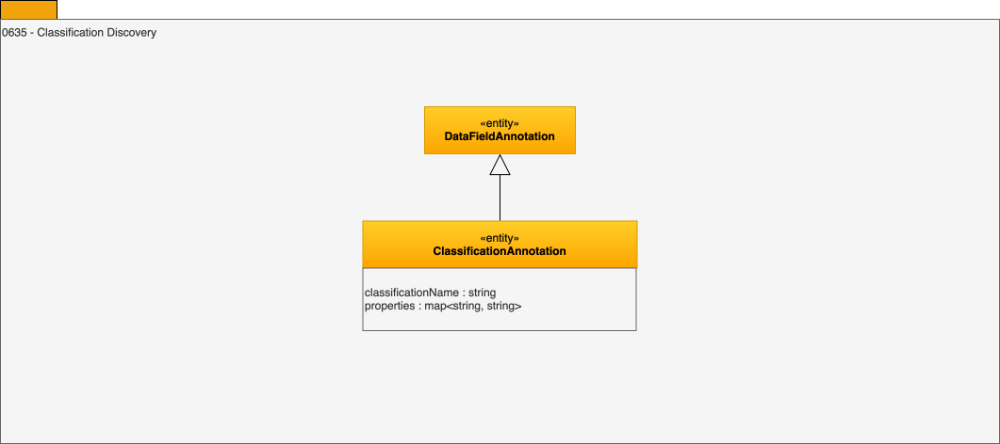

---
hide:
- toc
---

<!-- SPDX-License-Identifier: CC-BY-4.0 -->
<!-- Copyright Contributors to the ODPi Egeria project. -->

# 0635 Classification Discovery

Classification discovery adds suggestions for how the data could be classified.
These annotations are the discovery engine equivalent of the [Informal Tag](/types/1/0150-Feedback) shown in 0150 - Feedback in Area 1. 

--8<-- "snippets/abbr.md"