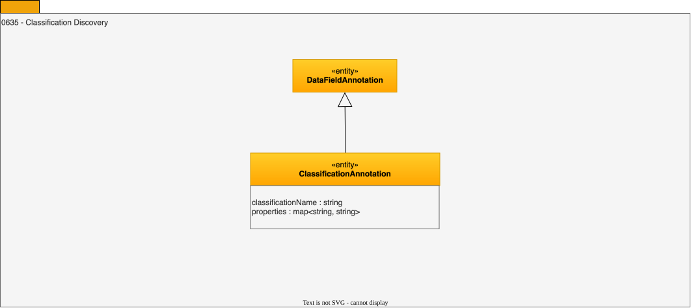

---
hide:
- toc
---

<!-- SPDX-License-Identifier: CC-BY-4.0 -->
<!-- Copyright Contributors to the ODPi Egeria project. -->

# 0635 Classification Discovery

Classification discovery adds suggestions for how the data could be classified.

## ClassificationAnnotation entity

Attached data field level annotations.

* *classificationName* - The name of the associated classification.
* *properties* - Property name-value pairs.

--8<-- "snippets/abbr.md"