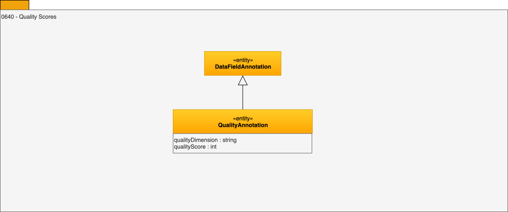

---
hide:
- toc
---

<!-- SPDX-License-Identifier: CC-BY-4.0 -->
<!-- Copyright Contributors to the ODPi Egeria project. -->

# 0640 Quality Scores

Quality scores describe how well the data values, typically in a data field, conform to a specification.

A schema attribute can have multiple quality scores associated to it,
for different types of problems. Examples of quality problem types include:

 * Data class violations
 * Data type violations
 * Format violations
 * Minimum/Maximum value violations
 * Missing values
 * Suspect values
 * Duplicate values
 * Rule violations

The set of problem types is open and dependent on a given system and the discovery service capabilities.

Each quality score for each type of problem could have additional properties associated to it such as
confidence, date it was calculated, for example.
The set of such properties may differ across discovery services and should be open.

A combined quality score for an entire resource can be typically calculated as
the average of the scores for all its columns, but other factors may be taken into
account by a given system and we should be able to associate a score to an Asset,
independently of the way it is calculated.

---8<-- "snippets/abbr.md"