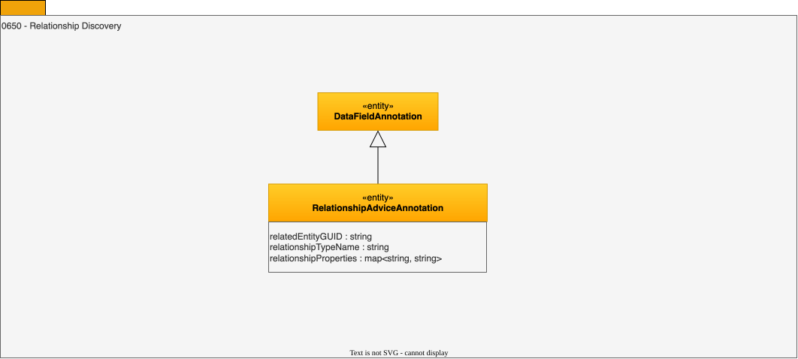

---
hide:
- toc
---

<!-- SPDX-License-Identifier: CC-BY-4.0 -->
<!-- Copyright Contributors to the ODPi Egeria project. -->

# 0650 Relationship Discovery

Relationship discovery identifies relationships between
different assets (or parts of assets), such as 2 columns that have a foreign key relationship.

## RelationshipAdviceAnnotation entity

A recommendation of the relationships that could be added to all or part of an Asset.

* *relationshipTypeName* - Type name of the potential relationship.
* *relationshipProperties* - Properties to add to the relationship.
* *relatedEntityGUID* - Entity that should be linked to the asset being analyzed.

--8<-- "snippets/abbr.md"