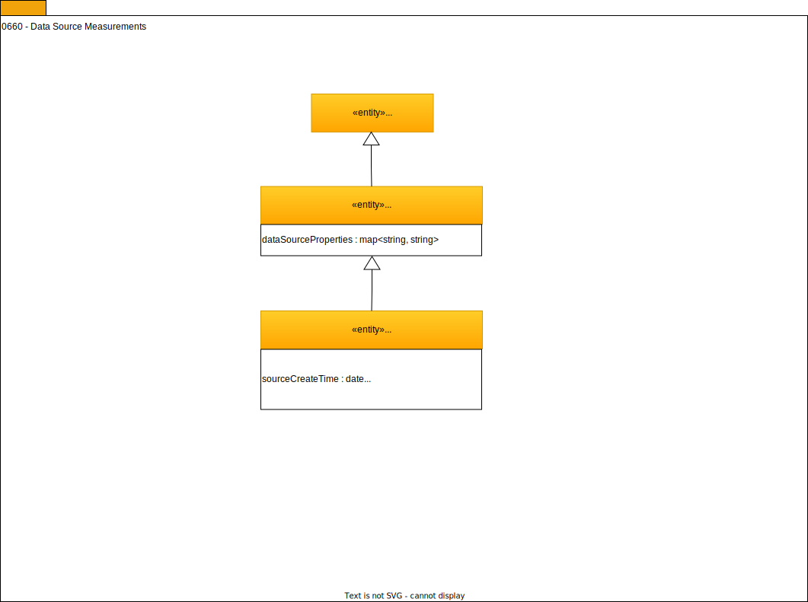

---
hide:
- toc
---

<!-- SPDX-License-Identifier: CC-BY-4.0 -->
<!-- Copyright Contributors to the ODPi Egeria project. -->

# 0660 Data Source Measurements

The Data Source Measurements capture a snapshot of the physical
dimensions and activity levels at a particular moment in time.

--8<-- "snippets/abbr.md"