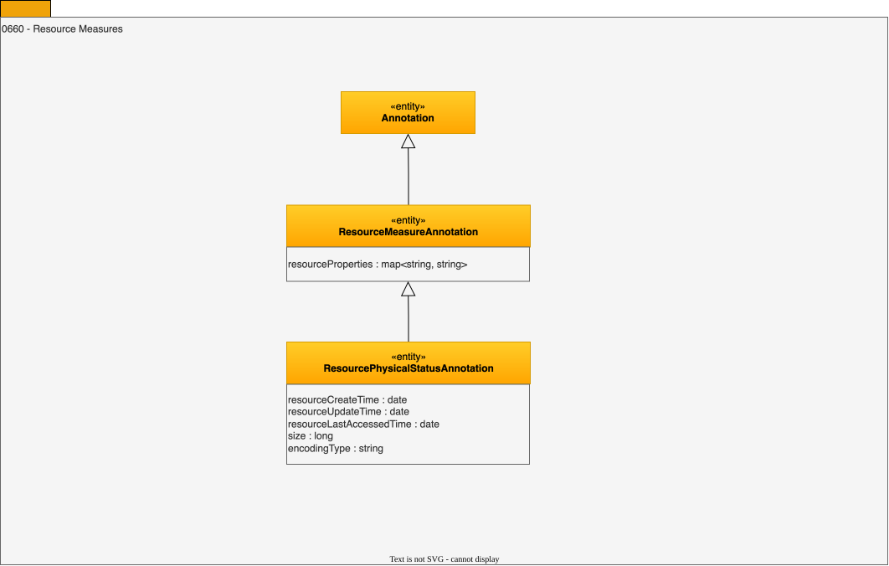

---
hide:
- toc
---

<!-- SPDX-License-Identifier: CC-BY-4.0 -->
<!-- Copyright Contributors to the ODPi Egeria project. -->

# 0660 Resource Measurements

The Resource Measures capture a snapshot of the physical
dimensions and activity levels at a particular moment in time.

## ResourceMeasureAnnotation entity

A summary set of measurements for a resource.

* *resourceProperties* - Discovered properties of the resource.

## ResourcePhysicalStatusAnnotation entity

A set of summary properties about the physical status of a resource.

* *resourceCreateTime* - Creation time of the data store.
* *resourceUpdateTime* - Last known modification time.
* *resourceLastAccessedTime* - Last known access time.
* *size* - Size of the data source.
* *encodingType* - Type of encoding scheme used on the data.

--8<-- "snippets/abbr.md"