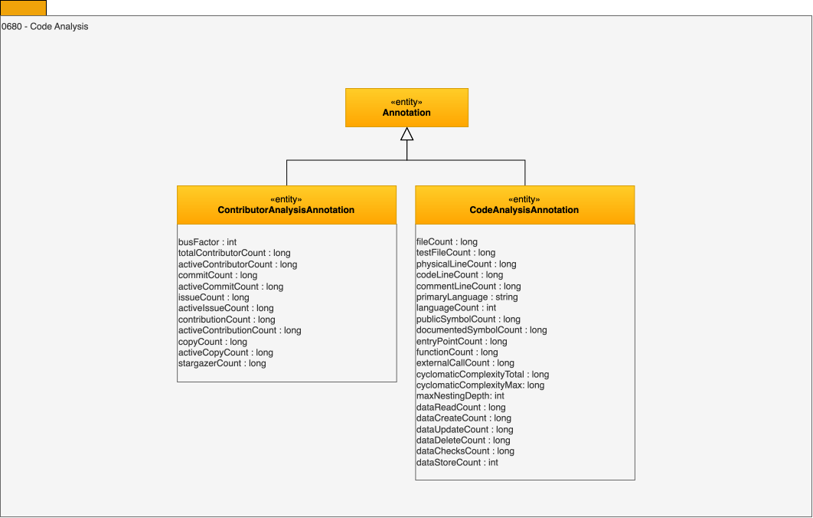

<!-- SPDX-License-Identifier: CC-BY-4.0 -->
<!-- Copyright Contributors to the ODPi Egeria project 2020. -->

# 0680 - Code Analysis

These [Annotations](/types/6/0610-Annotations) capture the results from the analysis of file - typically associated with source code found in a repository.

## CodeAnalysisAnnotation entity

The *CodeAnalysisAnnotation* entity captures the results from the analysis of a source code file.  The attributes are grouped as follows:

* *fileCount* - Number of files in the source code repository.
* *lineCount* - Total number of physical lines in the source code repository, including blank lines and comments.
* *codeLineCount* - Number of lines of code in the source code repository, excluding blank lines and comments.
* *commentLineCount* - Number of comment lines in the source code repository.  This is measured directly rather than derived from the other line counts so that it is still available when one of them is missing.
* *primaryLanguage* - The programming language that most of the source code in the repository is written in.
* *languageCount* - Number of distinct programming languages used in the source code repository.  Polyglot components carry a higher maintenance cost.
* *publicSymbolCount* - Number of symbols that the component exports for use by its callers, such as public functions, classes and endpoints.
* *entryPointCount* - Number of entry points into the component, such as main methods, command line commands, route handlers and task definitions.
* *dataReadCount* - Number of places in the code where data is read.
* *dataCreateCount* - Number of places in the code where data is created.
* *dataUpdateCount* - Number of places in the code where data is updated.
* *dataDeleteCount* - Number of places in the code where data is deleted.
* *dataChecksCount* - Number of places in the code where data is validated.
* *dataStoreCount* - Number of distinct data stores that the code touches.  This gives the magnitude of the blast radius when the component misbehaves.
* *externalCallCount* - Number of calls that the code makes out of the component.
* *functionCount* - Number of functions in the source code repository.  Paired with cyclomaticComplexityTotal, this makes the mean cyclomatic complexity derivable.
* *cyclomaticComplexityTotal* - Sum of the cyclomatic complexity of every function in the source code repository.
* *cyclomaticComplexityMax* - The highest cyclomatic complexity found in any single function in the source code repository.  A single very complex function is a risk that a mean value hides.
* *maxNestingDepth* - The deepest level of nested control flow found in any single function in the source code repository.
* *testFileCount* - Number of files in the source code repository that contain tests.
* *documentedSymbolCount* - Number of exported symbols that carry documentation.  Paired with publicSymbolCount, this gives the documentation coverage of the component's public surface.

## ContributorAnalysisAnnotation entity

The *ContributorAnalysisAnnotation* entity captures the results from the analysis of a source code repository.

* *busFactor* -  the minimum number of team members that have to suddenly disappear from a project before the project stalls due to lack of knowledgeable or competent personnel.
* *totalContributorCount* - the number of distinct contributors to the repository during its lifetime.
* *activeContributorCount* - the number of distinct contributors to the repository in the last year.
* *commitCount* - the number of commits to the repository during its lifetime.
* *activeCommitCount* - the number of commits to the repository in the last year.
* *issueCount* - the number of issues reported in the repository during its lifetime.
* *activeIssueCount* - the number of issues reported in the repository in the last year.
* *contributionCount* - the number of pull requests opened in the repository during its lifetime.
* *activeContributionCount* - the number of pull requests opened in the repository in the last year.
* *copyCount* - the number of forks of the repository during its lifetime.
* *activeCopyCount* - the number of forks of the repository in the last year.
* *stargazerCount* - the number of people who have starred the repository during its lifetime.

--8<-- "snippets/abbr.md"