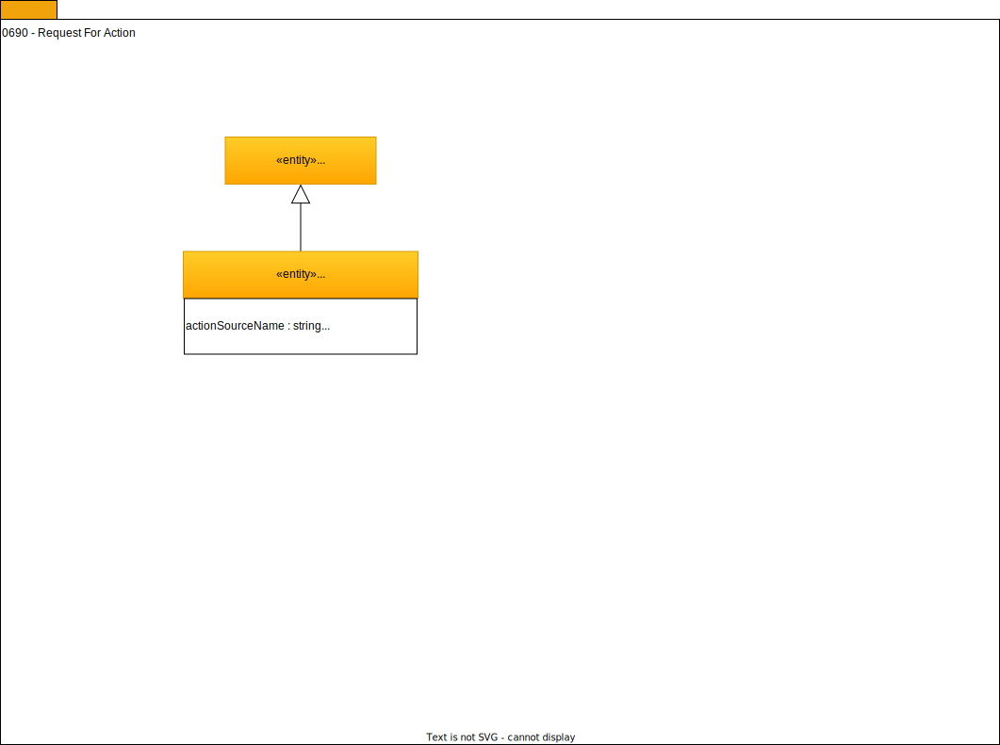

---
hide:
- toc
---

<!-- SPDX-License-Identifier: CC-BY-4.0 -->
<!-- Copyright Contributors to the ODPi Egeria project. -->

# 0690 Request for Action

A RequestForAction entity (RfA) is used to trigger the
[Stewardship Action OMAS](/egeria-docs/services/omas/stewardship-action).

It is used when the discovery service performs a test on the
data (such as a discovery rule) or has discovered an anomaly in
the data landscape compared to its metadata that potentially needs
a steward or a curator's action.

The governance action framework is configured to
respond to the requests for actions (RfAs).

--8<-- "snippets/abbr.md"