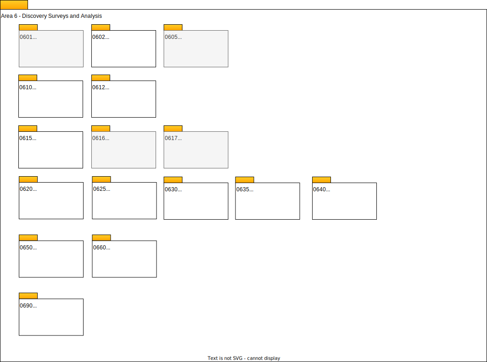

---
hide:
- toc
---

<!-- SPDX-License-Identifier: CC-BY-4.0 -->
<!-- Copyright Contributors to the ODPi Egeria project. -->

# Area 6 Models - Metadata Discovery

Area 6 provides structures for recording the results of automated metadata discovery as annotations to associated assets in the metadata repository.

Metadata discovery requires different types of analysis. This analysis may run just once, say when the asset is created, on demand or based on an event or schedule.

A particular type of analysis is implemented in an [open discovery service](/egeria-docs/concepts/open-discovery-service). Within the open discovery service are one to many discovery steps. Each step performs some sort of analysis that may result in an [annotation](/egeria-docs/concepts/discovery-analysis-report/#discovery-annotations) for one or more assets.

The annotations from a particular run of an open discovery service are grouped together into a [discovery analysis report](/egeria-docs/concepts/discovery-analysis-report).  The annotations may be reviewed and approved by a steward. The steward may convert the annotation to a harden metadata type, or they may flag the annotation as invalid. When the discovery service is rerun, the new annotations can be matched to the annotations from the previous run. The steward's actions will impact how the new annotations are processed.

* **[0601 Open Discovery Engines and Services](0601-Open-Discovery-Engine.md)**
* **[0605 Discovery Analysis Report](0605-Open-Discovery-Analysis-Reports.md)**
* **[0610 Annotation](0610-Annotations.md)**
* **[0611 Annotation Reviews](0612-Annotation-Reviews.md)**
* **[0615 Schema Extraction](0615-Schema-Extraction.md)**
* **[0617 Data Field Analysis](0617-Data-Field-Analysis.md)**
* **[0620 Data Profiling](0620-Data-Profiling.md)**
* **[0625 Data Class Discovery](0625-Data-Class-Discovery.md)**
* **[0630 Semantic Discovery](0630-Semantic-Discovery.md)**
* **[0635 Classification Discovery](0635-Classification-Discovery.md)**
* **[0640 Quality Scores](0640-Quality-Scores.md)**
* **[0650 Relationship Discovery](0650-Relationship-Discovery.md)**
* **[0660 Measurements](0660-Data-Source-Measurements.md)**
* **[0690 Request for Action](0690-Request-for-Action.md)**

Egeria's [Open Discovery Framework (ODF)](/egeria-docs/frameworks/odf/overview) supports the development and execution of open discovery services.  The ODF runs in an [Engine Host](/egeria-docs/concepts/engine-host) server.  ODF discovery services use connectors from the [Open Connector Framework (OCF)](/egeria-docs/frameworks/ocf/overview) to connect to the data assets and access the known metadata about them. 

--8<-- "snippets/abbr.md"
