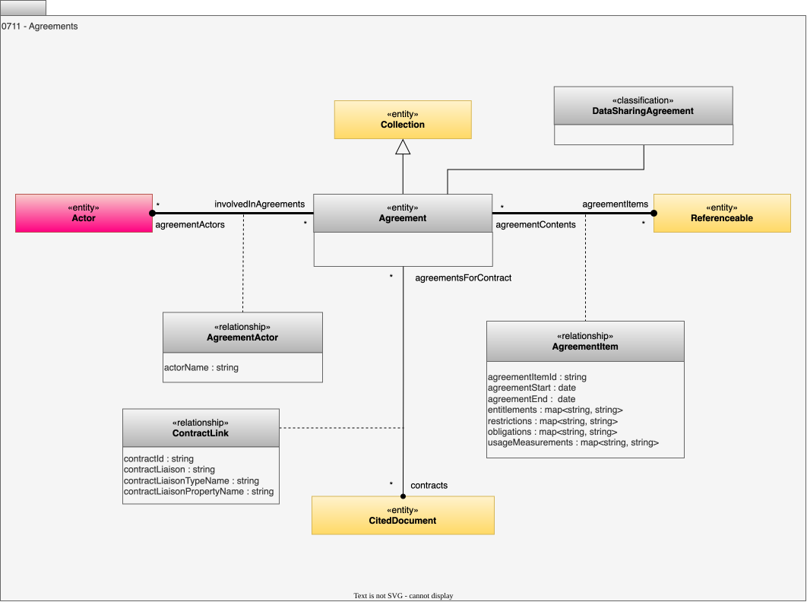

<!-- SPDX-License-Identifier: CC-BY-4.0 -->
<!-- Copyright Contributors to the ODPi Egeria project. -->

# 0711 Agreements

Agreements are used to record agreements between parties

## Agreement entity

An *Agreement* entity represents an agreement between parties.  This could be anything from an informal agreement to a legal binding contract.  The type of agreement is indicated by the *agreementType* property.  The [terms and conditions](/types/4/0440-Organizational-Controls) of the agreement can be attached with the [GovernedBy](/types/4/0401-Governance-Definitions) relationship.  

Agreement is a type of [Collection](/types/0/0021-Collections) to enable it to act as a folder for all the supporting information for the agreement.  For example, if the agreement is a data sharing agreement, then the associated [data specifications](/types/5/0580-Data-Dictionaries) can be attached as members of the agreement.

## DataSharingAgreement classification

The *DataSharingAgreement* indicates that the agreement relates to the sharing of data.

## ContractLink relationship

The *ContractLink* relationship links in the [ExternalReference](/types/0/0015-Linked-Media-Types) that identifies the location of an associated contract.

* *contractId* - Identifier for the contract used in the agreement.
* *contractLiaison* - Identifier of actor to contact with queries relating to the contract.
* *contractLiaisonTypeName* - Type name of liaison actor element.
* *contractLiaisonPropertyName* - The property from the actor element used as the identifier.

## AgreementItem relationship

The *AgreementItem* relationship identifies an element (any [Referenceable](/types/0/0010-Base-Model)) that is a part of the agreement.  For example, the *Agreement* may represent the End User License Agreement (EULA) for a user of a data product marketplace.  The *AgreementItem* would link to each data product that the user has subscribed to.  The properties of the *AgreementItem* fixes the details of the agreement with respect to the specific [digital product](/types/7/0710-Digital-Products).

* *agreementItemId* - Unique identifier for the item within the agreement.
* *agreementStart* - Date/time when this item becomes active in the agreement.
* *agreementEnd* - Date/time when this item becomes inactive in the agreement.
* *entitlements* - The named list of rights and permissions granted.
* *restrictions* - The named list of limiting conditions or measures imposed.
* *obligations* - The named list of actions, duties, or commitments required.
* *usageMeasurements* - Measurements of the actual use of this item under the agreement.

## AgreementActor relationship

The *Agreement* may detail specific responsibilities of the different parties.  These parties are given party (role) names in the agreement. These parties are identified by the *AgreementActor* relationship.   The *agreementPartyName* attribute identifies the party name described in the agreement.

* *actorName* - Name used to identify a specific actor in the agreement.

--8<-- "snippets/abbr.md"