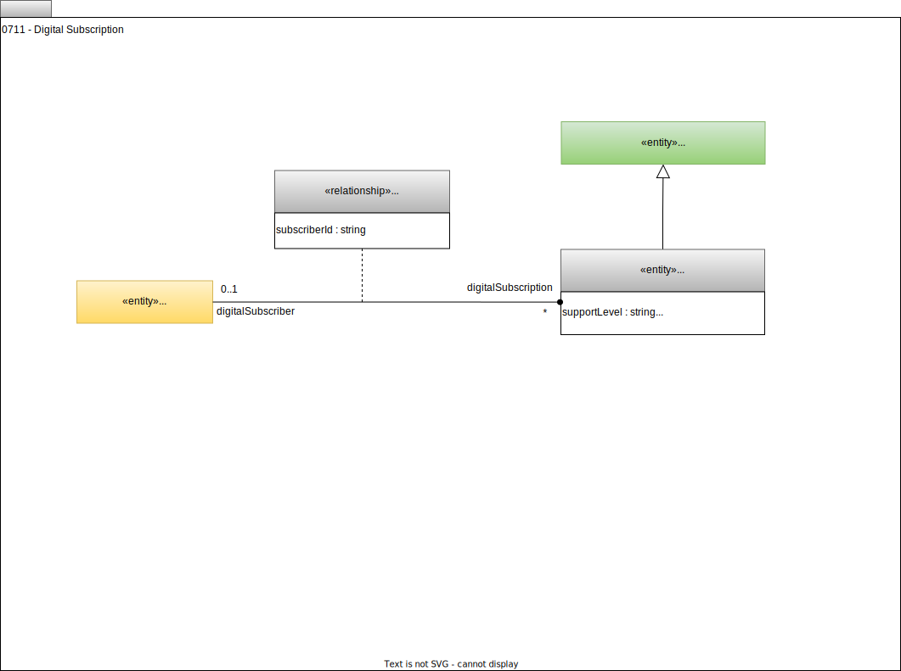

---
hide:
- toc
---

<!-- SPDX-License-Identifier: CC-BY-4.0 -->
<!-- Copyright Contributors to the ODPi Egeria project. -->

# 0711 Digital Subscription

The *DigitalSubscription* entity is a specialized [Agreement](/type/4/0484-Agreements) for a subscription to a [Digital Service](/types/7/0710-Digital-Service), [Digital Product](/types/7/0710-Digital-Service) or [Asset](/types/0/0010-Base-Model).

The *DigitalSubscriber* relationship links to the element that represents the subscriber.  For example, this could be a [UserIdentifier](/types/1/0110-Actors), [PersonRole](/types/1/0112-People), [ActorProfile](/types/1/0110-Actors) or [Asset](/types/0/0010-Base-Model) such has a system.

--8<-- "snippets/abbr.md"