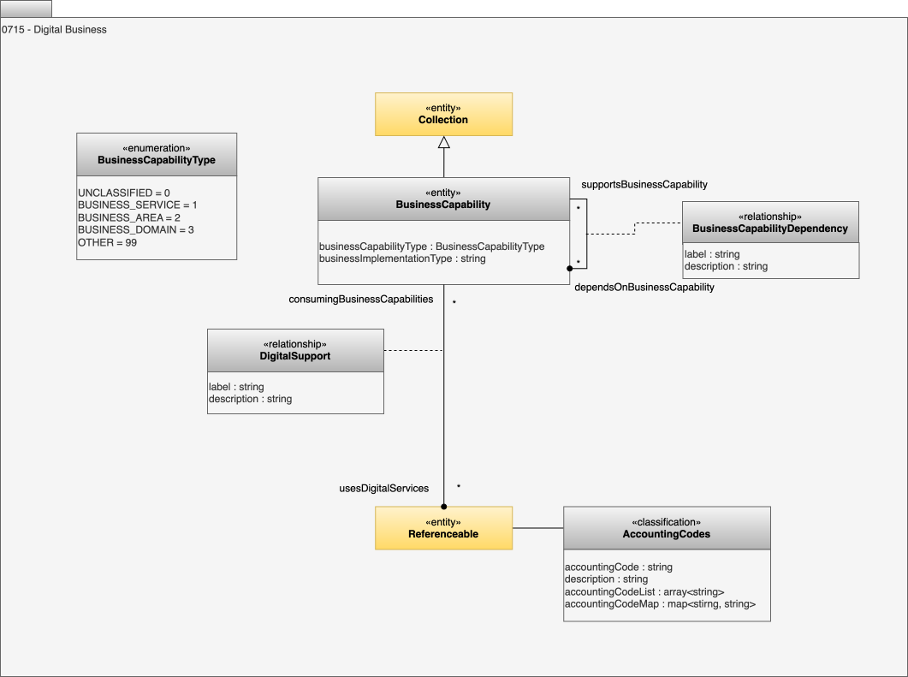

<!-- SPDX-License-Identifier: CC-BY-4.0 -->
<!-- Copyright Contributors to the ODPi Egeria project. -->

# 0715 Digital Business

This model supports the description of the business domain where the digital product owners and consumers reside.

## BusinessCapability entity

*BusinessCapability* describes the business responsibility or services provided by a team in an organization.  It is linked to the owning team using the *CollectionMembership* relationship.

* *businessCapabilityType* - Defines the type or category of a business capability.
* *businessImplementationType* - Implementation type for the business capability.

## BusinessCapabilityType enum

*BusinessCapabilityType* lists the broad categories of business capability.

* *BusinessService* - A functional business capability.
* *BusinessArea* - A collection of related business services.
* *BusinessDomain* - An overall area of activity in which a business operates.  A single organization may operate multiple business domains, such a retail, distribution, banking, ...

## BusinessCapabilityDependency relationship

Business domains can be modelled with nested business areas and business services. The *BusinessCapabilityDependency* relationship describes the dependency between two business capabilities. 

## DigitalSupport relationship

*DigitalSupport* describes the support provided by a digital service to a business capability.  The *supportedBusinessCapability* is supported by the *usesDigitalService* element that is typically an [Asset](/concepts/asset) or [DigitalProduct](/concepts/digital-product).

## AccountingCodes classification

The *AccountingCodes* classification describes the accounting codes associated with an element.  These codes are used to track the financial aspects of the element. Some organization have complex accounting structures and so the *AccountingCodes* classification has multiple options for expressing one or more codes.

* The *accountingCode* attribute is used to describe a single code.
* The *accountingCodeList* attribute is used to describe a set of codes.  If multiple codes are used then *accountingCode* would contain the primary/default/preferred value.
* The *accountingCodeMap* attribute is used to describe a set of name-to-code mappings.

* *accountingCode* - An identifier used to tie an element to an account or budget.
* *description* - Description of the element or associated resource in free-text.
* *accountingCodeList* - A list of accounting codes used to tie an element to multiple accounts or budgets.
* *accountingCodeMap* - A map of names to accounting codes used to tie an element to multiple accounts or budgets.

--8<-- "snippets/abbr.md"