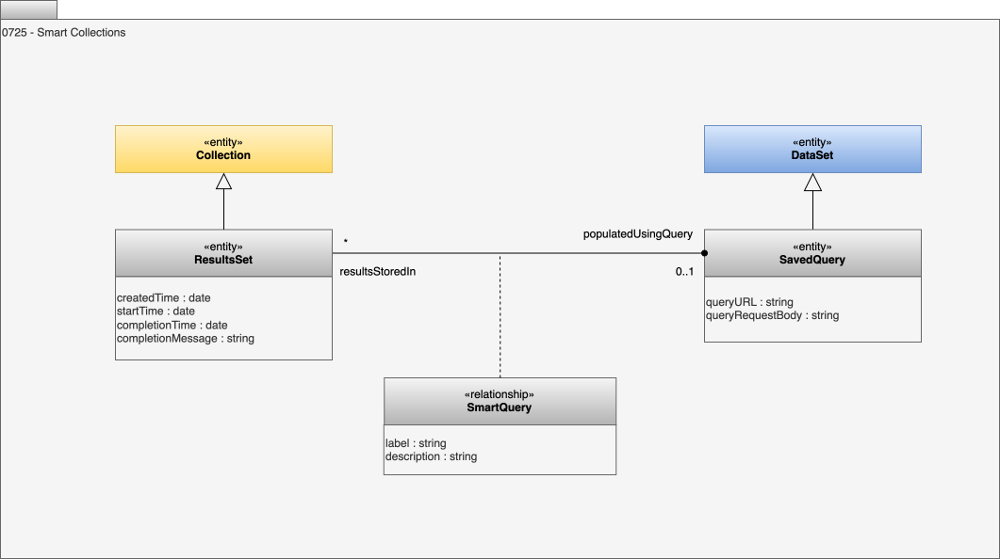

<!-- SPDX-License-Identifier: CC-BY-4.0 -->
<!-- Copyright Contributors to the ODPi Egeria project 2020. -->

# 0725 Smart Collections

Smart collections use open metadata queries to populate a results set collection.

## ResultsSet entity

The *ResultsSet* entity is a type of [Collection](/types/1/0021-Collections) whose membership is set of elements that are the results from a specific request or query.

* *createdTime* - the time the first query was run.
* *startTime* - the start of the last query to run.
* *completionTime* - the end of the last query to run.
* *completionMessage* - any message generated by the last query that attempted to maintain the result set.

## SavedQuery entity

An *SavedQuery* entity is a [DataSet](/types/2/0210-Data-Stores) that provides the definition of a RESTful query to Egeria that returns Open Metadata Elements.

* *queryURL* - the query URL to issue to Egeria.
* *queryRequestBody* - the parameters to the query organized into a request body structure (JSON).

## SmartQuery relationship

The *SmartQuery* relationship connects a **SavedQuery** entity to a **ResultSet** entity.  This indicates that the result set is populated by the saved query.

* *label* - the label for the query.
* *description* - the description for the query.

--8<-- "snippets/abbr.md"