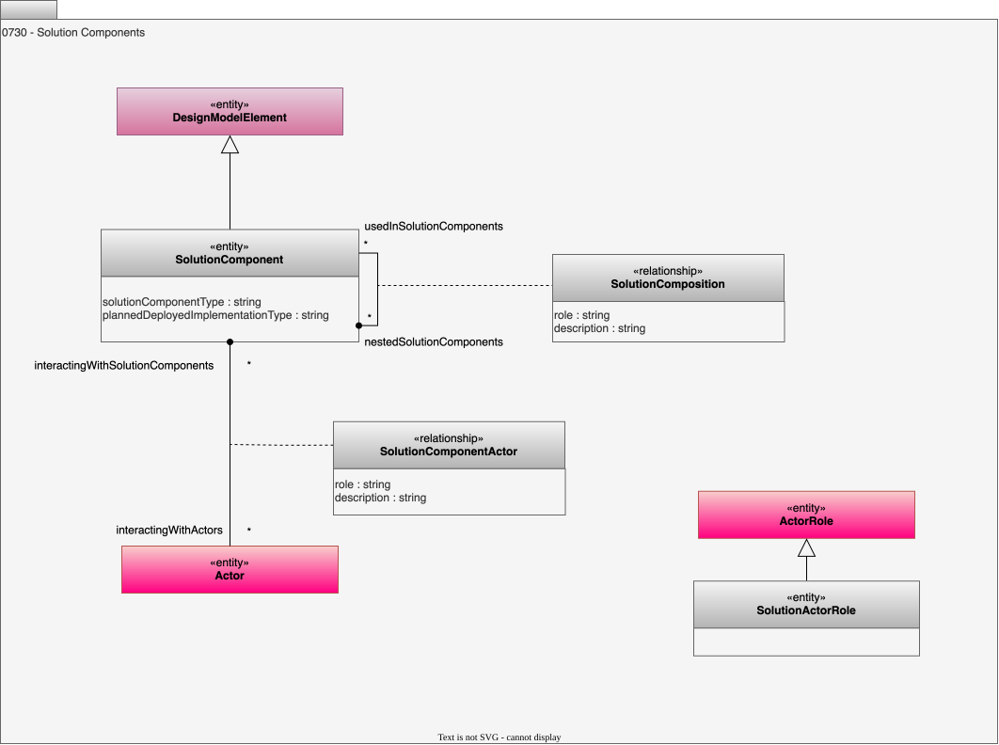

<!-- SPDX-License-Identifier: CC-BY-4.0 -->
<!-- Copyright Contributors to the ODPi Egeria project 2020. -->

# 0730 Solution Components

Solution components provide an architectural summary of the logical components that make up the IT landscape.  These components are linked together via [Solution Ports and Wires](/types/7/0735-Solution-Ports-and-Wires)

## SolutionComponent entity

A *SolutionComponent* is an architecture description of a digital implementation that provides a well-defined function.  They can be modelled as *UML components* and provide a way to organize the digital landscape into coarse-grained functional components. Solution components communicate via [ports and wires](/types/7/0735-Solution-Ports-and-Wires).

* *solutionComponentType* - The type of solution component - for example, is it a process, of file or database.
* *plannedDeployedImplementationType* - The type of software component that is likely to serve as an implementation for this solution component.

## SolutionComposition relationship

The *SolutionComposition* relationship allows solution components to be decomposed into smaller solution components.

* *role* - Role that this artifact plays in implementing the abstract representation.
* *description* - Description of the element or associated resource in free-text.

## SolutionActorRole entity

A *SolutionActorRole* is a type of [ActorRole](/types/1/0118-Actor-Roles) that is principally interacting with a solution.

## SolutionComponentActor relationship

The *SolutionComponentActor* records the [Actors](/types/1/0110-Actors) that are interacting with the solution components.  Typically, these are *SolutionActorRole* entities.

* *role* - Role that this artifact plays in implementing the abstract representation.
* *description* - Description of the element or associated resource in free-text.

--8<-- "snippets/abbr.md"