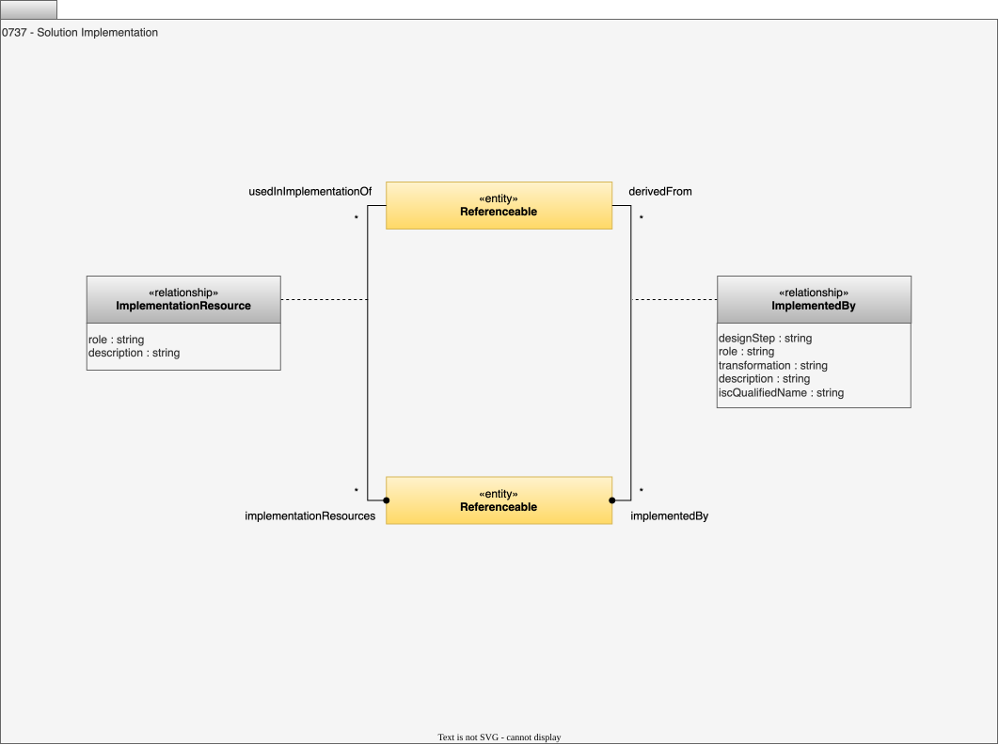

<!-- SPDX-License-Identifier: CC-BY-4.0 -->
<!-- Copyright Contributors to the ODPi Egeria project 2020. -->

# 0737 Solution Implementation

The solution implementation provides traceability from the architecture view to the implementation view.

## ImplementationResource relationship

The *ImplementationResource* relationship identifies useful components when building an implementation of the element at end 1.  The ends of this relationship are Referenceable to allow flexibility in the level of detail that is captured in open metadata.

* *role* - Role that this artifact plays in implementing the abstract representation.
* *description* - Description of the element or associated resource in free-text.

## ImplementedBy relationship

The *ImplementedBy* relationship can be used to identify how design elements, such as solution components and [design models](/types/5/0565-Design-Models) can be refined into implementation artifacts.  The ends of this relationship are [Referenceable](/types/0/0010-Base-Model) to allow flexibility in the level of detail that is captured in open metadata.

???+ info "API Support"
    Support for creating and maintaining these relationships is found in [Governance Officer API](/services/omvs/governance-officer/overview) and, for connectors, in the [GovernanceDefinitionClient](https://odpi.github.io/egeria/org/odpi/openmetadata/frameworks/openmetadata/connectorcontext/GovernanceDefinitionClient.html) of the connector's context.

* *designStep* - Process that created the refinement.
* *role* - Role that this artifact plays in implementing the abstract representation.
* *transformation* - Transformation process used to create the refinement.
* *description* - Description of the element or associated resource in free-text.
* *iscQualifiedName* - Unique name for the associated Information Supply Chain.

--8<-- "snippets/abbr.md"