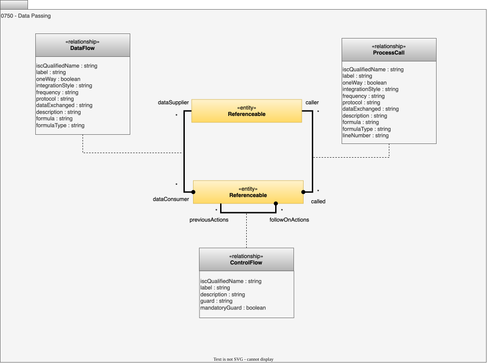

---
hide:
- toc
---

<!-- SPDX-License-Identifier: CC-BY-4.0 -->
<!-- Copyright Contributors to the ODPi Egeria project. -->

# 0750 Data Passing

Describes relationships that show where data and control is passed between components. These relationships show the structure of the data processing. They can link [Assets](/types/0/0010-Base-Model/#asset), or [Ports](/types/2/0217-Ports) or [SchemaAttributes](/types/5/0505-Schema-Attributes) depending on the level of detail that is known.

??? deprecated "Deprecated types"
    - *ProcessInput*
    - *ProcessOutput*

## ControlFlow relationship

Shows that when one element completes processing, control passes to the next element.

* *guard* - Function, or value that must be true to travel down this control flow.
* *mandatoryGuard* - Is this guard mandatory for the next step to run.

## DataFlow relationship

Shows that data flows in one direction from one element to another.

* *formula* - Formula that describes the behaviour of the element. May include placeholders for queryIds.
* *formulaType* - Format of the expression provided in the formula attribute.

## ProcessCall relationship

Shows a request-response call between two elements.

* *formula* - Formula that describes the behaviour of the element. May include placeholders for queryIds.
* *formulaType* - Format of the expression provided in the formula attribute.
* *lineNumber* - Location of the call in the implementation.

--8<-- "snippets/abbr.md"
