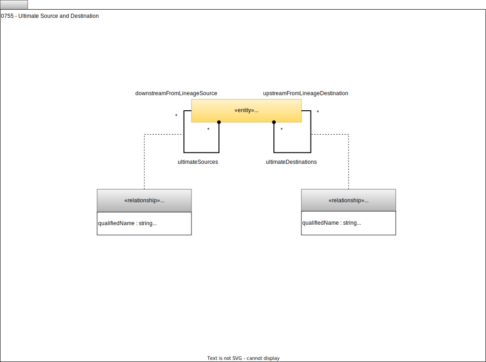

<!-- SPDX-License-Identifier: CC-BY-4.0 -->
<!-- Copyright Contributors to the ODPi Egeria project. -->

# 0755 Ultimate Sources and Destinations

Describes relationships that show the ends of the lineage graph for an individual element. The aim is to capture knowledge about the length and ends of the lineage graph for a popular element so it can be quickly retrieved rather than needing to traverse the graph each time this information is requested.

These relationships can link [Assets](/types/0/0010-Base-Model/#asset), or [Ports](/types/2/0217-Ports) or [SchemaAttributes](/types/5/0505-Schema-Attributes) depending on the level of detail that is known.  There are no rules on which elements in the information supply chain are given ultimate source and/or ultimate destination relationships.  In the example above, they only appear on the data sources and not the processes.  This could be further reduced by only including those assets that are [critical data sources](/types/4/0422-Governance-Action-Classifications).    

## UltimateSource relationship

The *UltimateSource* relationship links a node in the lineage graph to its ultimate source - ie the node at the start of the lineage data flow.  Its attributes are:

* qualifiedName - Unique name of the associated [information supply chain](/types/7/0720-Information-Supply-Chains).
* distance - The number of hops along the lineage graph to the ultimate source organized by type of element.

## UltimateDestination relationship

The *UltimateDestination* relationship links a node in the lineage graph to its ultimate destination - ie the node at the end of the lineage data flow.  Its attributes are:

* qualifiedName - Unique name of the associated [information supply chain](/types/7/0720-Information-Supply-Chains).
* distance - The number of hops along the lineage graph to the ultimate destination organized by type of element.

--8<-- "snippets/abbr.md"