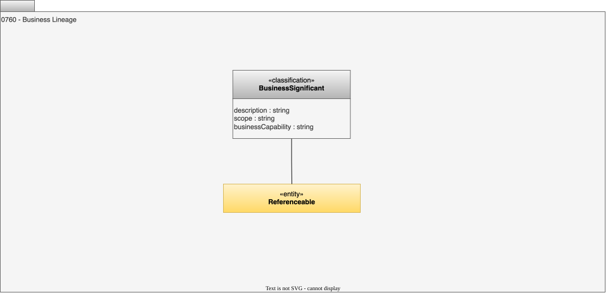

---
hide:
- toc
---

<!-- SPDX-License-Identifier: CC-BY-4.0 -->
<!-- Copyright Contributors to the ODPi Egeria project 2020. -->

# 0760 Business Lineage

Business lineage is a type of lineage where only elements that have been tagged as business significant are shown. This allows some technical detail to be eliminated from the lineage display.

## BusinessSignificant classification

A referenceable item that is meaningful to business users.

* *description* - Description of the element or associated resource in free-text.
* *scope* - Breadth of responsibility or coverage.
* *businessCapability* - Identifier of the business capability where this resource originated from.

--8<-- "snippets/abbr.md"
