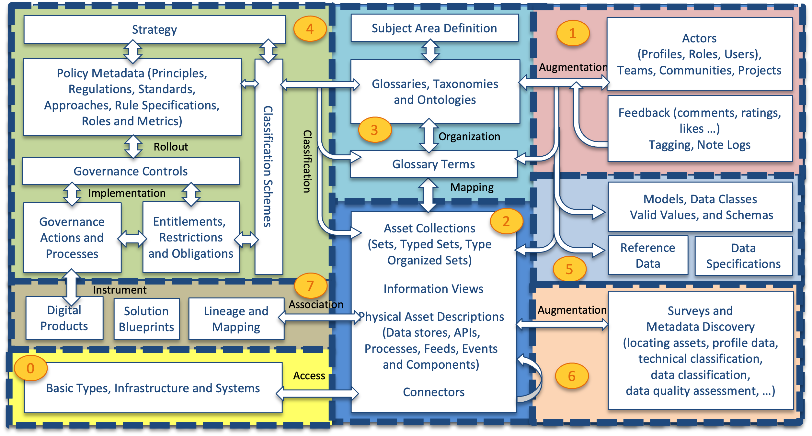

---
hide:
- toc
---

<!-- SPDX-License-Identifier: CC-BY-4.0 -->
<!-- Copyright Contributors to the Egeria project. -->

# The open metadata type system

Knowledge about data is spread amongst many people and systems. One of the roles of a metadata repository is to provide a place where this knowledge can be collected and correlated, as automated as possible. To enable different tools and processes to populate the metadata repository we need agreement on what data should be stored and in what format (structures).

The different areas of metadata that we need to support for a wide range of metadata management and governance tasks include:

This metadata may be spread across different metadata repositories that each specialize in particular use cases or communities of users.

| Area | Description |
|---|---|
| [Area 0](0) | describes base types and infrastructure. This includes the root type for all open metadata entities called `OpenMetadataRoot` and types for `Asset`, `DataSet`, `Infrastructure`, `Process`, `Referenceable`, `SoftwareServer` and `Host`. |
| [Area 1](1) | collects information from people using the data assets. It includes their use of the assets and their feedback.  It also manages crowd-sourced enhancements to the metadata from other areas before it is approved and incorporated into the governance program. |
| [Area 2](2) | describes the data assets. These are the data sources, APIs, analytics models, transformation functions and rule implementations that store and manage data. The definitions in Area 2 include connectivity information that is used by the open connector framework (and other tools) to get access to the data assets. |
| [Area 3](3) | describes the glossary. This is the definitions of terms and concepts and how they relate to one another.  Linking the concepts/terms defined in the glossary to the data assets in Area 2 defines the meaning of the data that is managed by the data assets. This is a key relationship that helps people locate and understand the data assets they are working with. |
| [Area 4](4) | defines how the data assets should be governed. This is where the classifications, policies and rules are defined. |
| [Area 5](5) | is where standards are established. This includes data models, schema fragments and reference data that are used to assist developers and architects in using best practice data structures and valid values as they develop new capabilities around the data assets. |
| [Area 6](6) | provides the additional information that automated metadata discovery engines have discovered about the data assets. This includes profile information, quality scores and suggested classifications. |
| [Area 7](7) | provides the structures for recording lineage. |

The following diagram provides more detail of the metadata structures in each area and how they link together:

???+ summary "Metadata is highly interconnected"
    

    Bottom left is Area 0 - the foundation of the open metadata types along with the IT infrastructure that digital systems run on such as platforms, servers and network connections. Sitting on the foundation are the assets. The base definition for `Asset` is in Area 0 but Area 2 (middle bottom) builds out common types of assets that an organization uses. These assets are hosted and linked to the infrastructure described in Area 0. For example, a data set could be linked to the file system description to show where it is stored.

    Area 5 (right middle) focuses on defining the structure of data and the standard sets of values (called reference data). The structure of data is described in schemas and these are linked to the assets that use them.

    Many assets have technical names. Area 3 (top middle) captures business and real world terminologies and organizes them into glossaries. The individual terms described can be linked to the technical names and labels given to the assets and the data fields described in their schemas.

    Area 6 (bottom right) captures additional metadata captured through automated analysis of data. These analysis results are linked to the assets that hold the data so that data professionals can evaluate the suitability of the data for different purposes. Area 7 (left middle) captures the lineage of assets from a business and technical perspective. Above that in Area 4 are the definitions that control the governance of all of the assets. Finally, Area 1 (top right) captures information about users (people, automated process) their organization, such as teams and projects, and feedback.

Within each area, the definitions are broken down into numbered packages to help identify groups of related elements. The numbering system relates to the area that the elements belong to. For example, area 1 has models 0100-0199, area 2 has models 0200-299, etc. Each area's sub-models are dispersed along its range, ensuring there is space to insert additional models in the future.

## Understanding the models

The diagram above shows a few fragments from the models. Each of the UML classes represents an open metadata type. The stereotype on the UML class in the double angle brackets of *entity*, *relationship* and *classification* defines the category of type: [Entity](/egeria-docs/introduction/key-concepts/#entities), [Relationship](/egeria-docs/introduction/key-concepts/#relationships) or [Classification](/egeria-docs/introduction/key-concepts/#classifications) respectively. The line between entities with the big arrow head means "inheritance". A type points to its supertype.

???+ example "The example on the left comes from model [0010](0/0010-base-model)"
    It shows that `Asset` inherits from `Referenceable` which inherits from `OpenMetadataRoot`. This means that `Asset` is a subtype of `Referenceable`, which is a subtype of `OpenMetadataRoot`. Alternatively, `OpenMetadataRoot` is the supertype of `Referenceable`, which is a supertype of `Asset`. This inheritance identifies which attributes (instance properties) are valid for an instance of a particular type since it is the aggregation of the attributes defined explicitly for the type and all of its supertypes.

    For example, `Asset` has two attributes defined: `name` and `description`. It also supports `qualifiedName` and `additionalProperties` because they are inherited from `Referenceable`. `OpenMetadataRoot` does not have any attributes defined so `Asset` gets nothing from it.

???+ example "The example on the right comes from model [0011](0/0011-managing-referenceables)"
    It shows the classification called `Template` that can be connected to a `Referenceable`. Since `Referenceable` is already defined in model 0010, it is shown without the white box where the attributes are show (called the "attribute container" in UML parlance).

    `SourcedFrom` is a relationship that connects two instances of `Referenceable` and any of its subtypes. This means `SourcedFrom` could connect two instances of type `Asset` together. The types of the instances connected do not need to be the same - `SourcedFrom` could connect a `Referenceable` instance with an `Asset` instance.

The UML model diagrams show the currently active types. Some types and attributes have been deprecated and these have been removed from the model diagrams. However, there is a description of the deprecated types and which of the active types to use instead. Although the deprecated types can be used (for backwards compatibility) it is always preferable to use the latest types since they are typically more efficient and more consistent than their predecessors.

## Attribute type definitions

The properties defined on each open metadata type will be one of the following attribute types:

- `object` 
- `boolean`
- `byte`
- `char`
- `short`
- `int`
- `long`
- `float`
- `double`
- `biginteger`
- `bigdecimal`
- `string`
- `date`
- `map<string,string>`
- `map<string,boolean>`
- `map<string,int>`
- `map<string,long>`
- `map<string,object>`
- `array<string>`
- `array<int>`

--8<-- "snippets/abbr.md"
