<!-- SPDX-License-Identifier: CC-BY-4.0 -->
<!-- Copyright Contributors to the Egeria project. -->

# Data Mesh

**Data Mesh** is a web-based user interface for exploring the [data mesh](/concepts/data-mesh) - the network of [digital products](/concepts/digital-product) in your organization and the dependencies between them.  It draws every digital product as a node in an interactive graph, with an arrow for each [*DigitalProductDependency*](/types/7/0710-Digital-Products) relationship, so you can see which products feed which, find the products that many others depend on, and follow the products that take part in a particular [information supply chain](/concepts/information-supply-chain).

Data Mesh is part of the web portal in the [Egeria Workspaces](/egeria-workspaces) [Quickstart](/egeria-workspaces/quick-start/overview) environment, where it is opened from the **Data Mesh** tile.  It is not *yet* available in Freshstart.

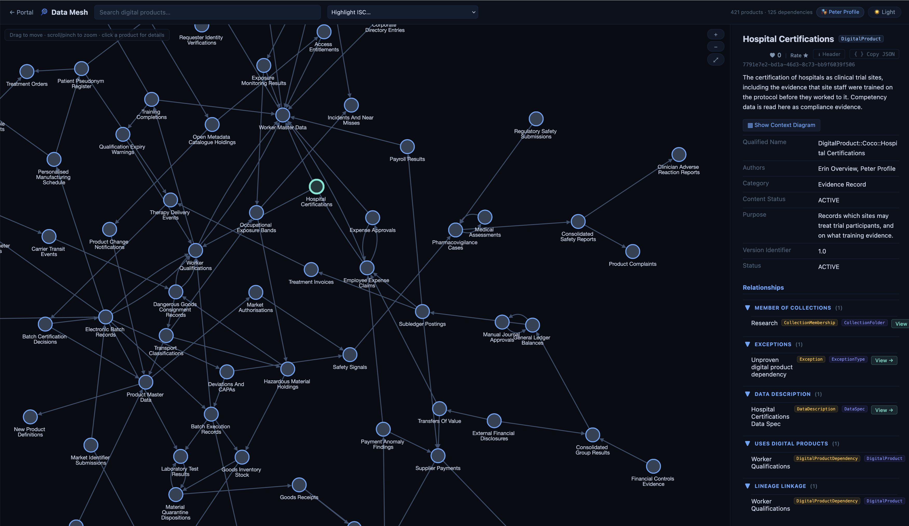
> The Data Mesh showing the Coco Pharmaceuticals strategic digital products.  The *Hospital Certifications* product is selected, so its details are shown in the panel on the right.

## Exploring the graph

Each node in the graph is a digital product, labelled with its name.  The products and dependencies are laid out automatically, and the total number of each is shown at the right of the header.

This first image shows a new Egeria system with just the open metadata digital products created by the Jacquard Digital Product Loom, and a sample consumer product and provider product.  Notice that most of these products are laid out independently in a grid and are not connected to one another.  This is because they are not currently in use.

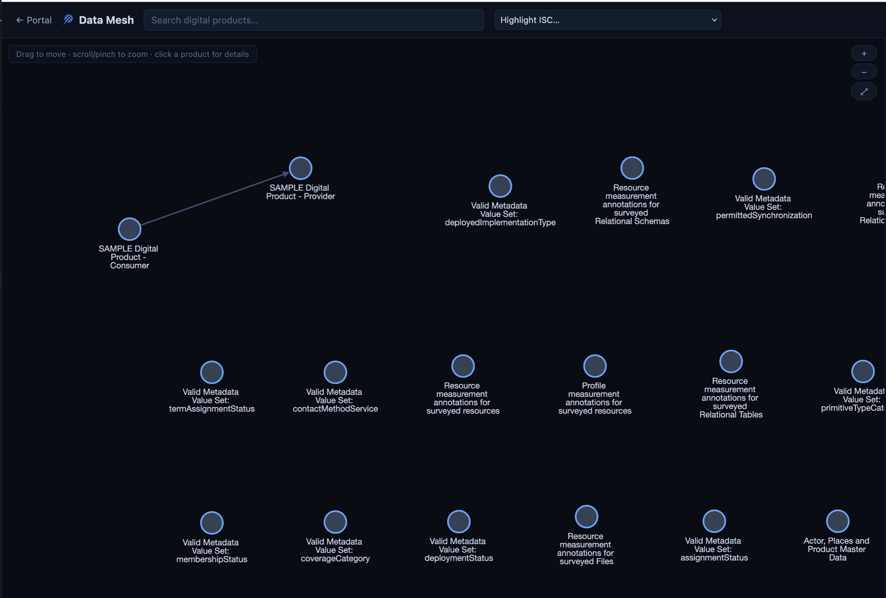

The two sample products are connected, however.  Each arrow is a *DigitalProductDependency* relationship, pointing from the product that consumes the data to the product that supplies it.

This next image shows [Coco Pharmaceuticals](/practices/coco-pharmaceuticals/overview) strategic digital products.  Here you can see many dependencies showing the products are connected to each other.

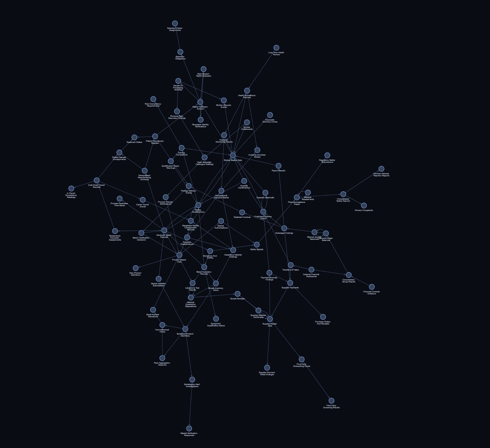

## Interacting with the graph

The application makes an initial attempt to lay out the graph.  However, you will probably want to rearrange it and zoom in and out to find what you are looking for.  The graph can be interacted with in a number of ways:

* Drag a product to move it, and scroll or pinch to zoom.  The buttons in the corner of the graph zoom in, zoom out and fit the whole graph to the window.
* Click a product to select it and show its details in the panel on the right.  Click the background of the graph to clear the selection.
* The bar at the bottom of the graph holds a legend explaining the colours used for products, search matches, the selected product, dependencies and the dependencies of the selected information supply chain.  It also holds the **Promise / Memento** checkbox described [below](#planned-and-retired-products).

## Finding products

Type at least two characters into the **Search digital products** box to search the digital products in the catalog.  The products that match are ringed in gold in the graph, and the number of matches is shown beside the search box.

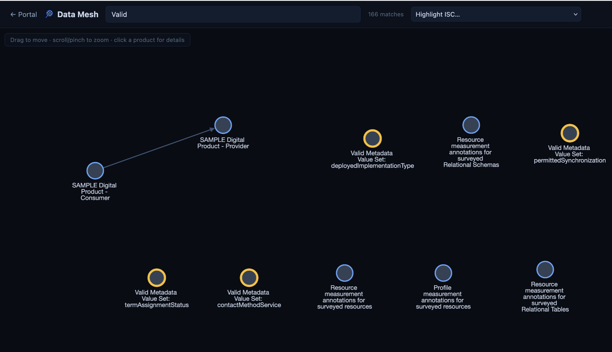

In a large mesh, this can be invaluable at locating the products you are interested in.

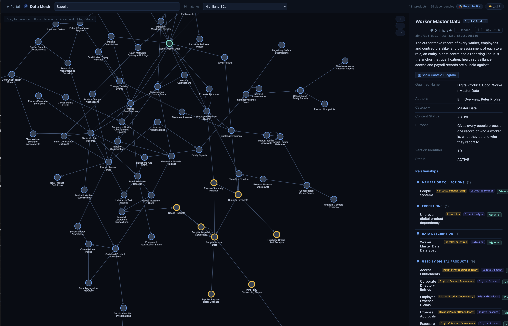

## Highlighting an information supply chain

Each *DigitalProductDependency* relationship can name the information supply chain that it is part of in its *iscQualifiedName* property.  The **Highlight ISC** list offers each information supply chain named by the dependencies in the graph.  Choosing one highlights its dependencies in gold and dims the rest of the graph, so that you can see which products take part in that information supply chain and how the data passes between them.  Clicking a dependency in the graph selects its information supply chain in the same way.  The list is only shown when at least one dependency names an information supply chain.

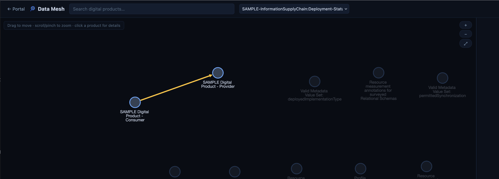

Again, in a large mesh, this highlighting helps to get you oriented on your area of interest.

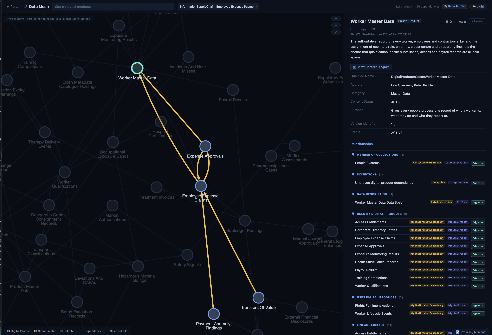

## Product details

The panel on the right shows the details of the selected product: its name, type and unique identifier, its description, a **Show Context Diagram** button that displays the [mermaid](/user-interfaces/mermaid/overview) diagram of the product and the elements linked to it, its properties and additional properties, its relationships to other elements, its classifications and its raw JSON.  You can also read and add comments, and give feedback on the product.  Drag the edge of the panel to make it wider or narrower.

Each related element in the *Relationships* section has a **View** button.  If the element is another digital product in the graph, it is selected in place; any other element is opened in [Egeria Explorer](/user-interfaces/egeria-explorer/overview) in a new browser tab.

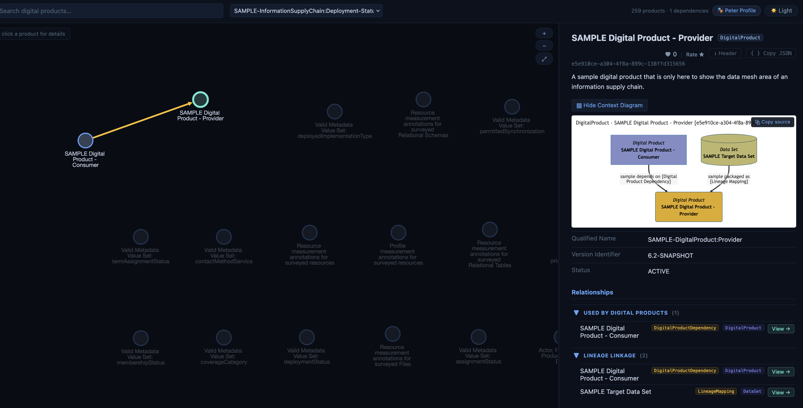

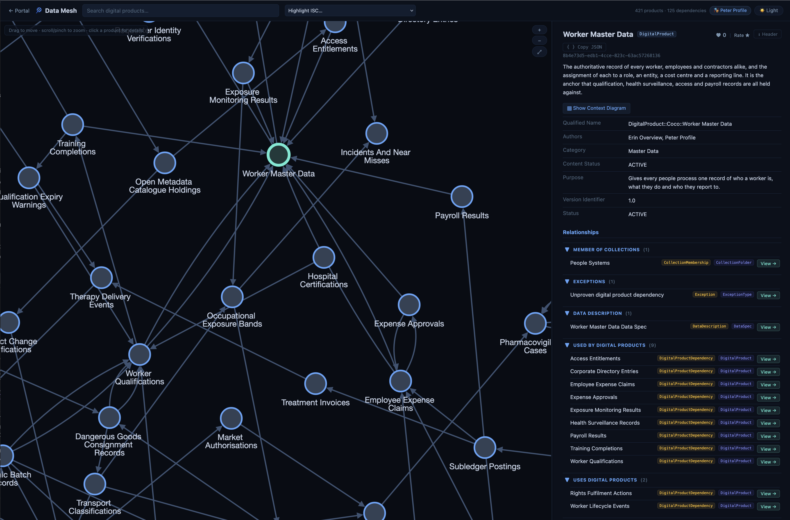

## Dependency Exceptions

A dependency that has been declared, but that the lineage between the products' assets does not prove, is recorded by Darwin as an [exception](/types/4/0455-Exception-Management) against the dependent product, and is listed in the *Exceptions* section of its details.  The sample consumer product has such an exception, because the sample declares its dependency without any lineage behind it.

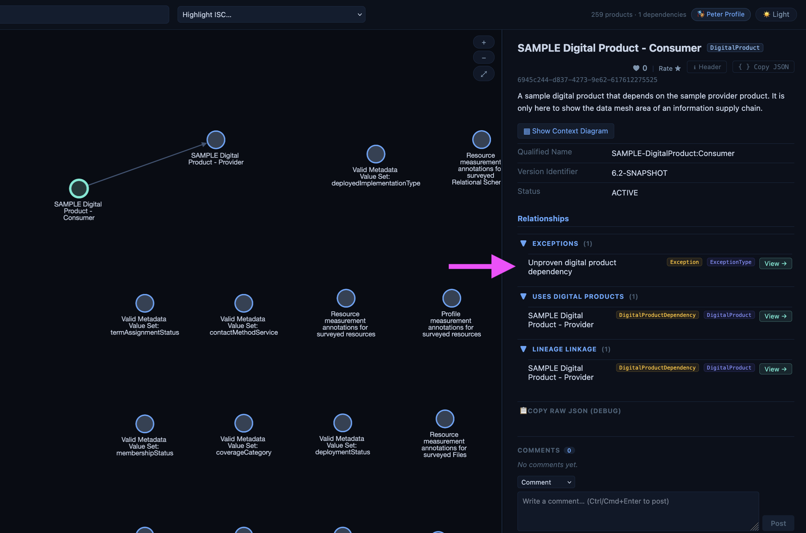

When you view the details of the exception, it displays a list of all the products that have this exception recorded against them.

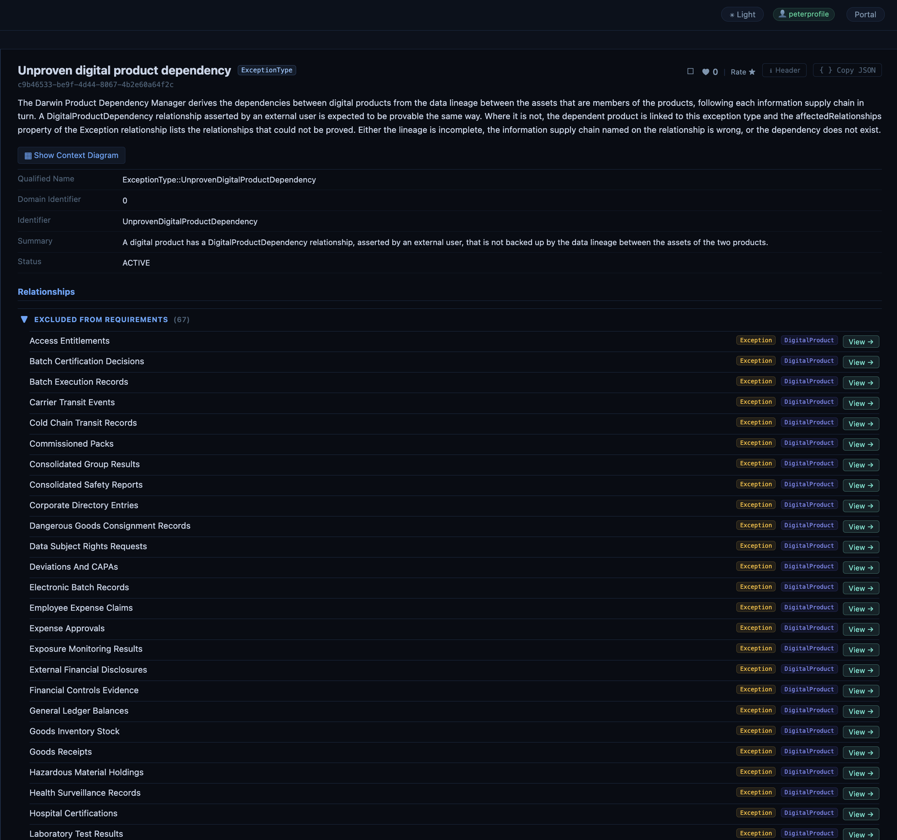

## Planned and retired products

Digital products and dependencies classified as [*Promise*](/concepts/promise) (not yet delivered) or [*Memento*](/concepts/memento) (retired) are hidden by default, in the same way as they are hidden from ordinary catalog queries.  Check **Promise / Memento** in the bar at the bottom of the graph to include them, so that you can see how the data mesh is planned to grow or how it used to be.

## Where the data mesh comes from

Data Mesh displays the digital products and dependencies that are in open metadata, so it shows whatever has been catalogued.  Digital products are created through the [Product Manager API](/services/omvs/product-manager/overview) and [Dr.Egeria](/user-interfaces/dr-egeria/overview), by the Jacquard Digital Product Loom for the [Open Metadata Digital Product Catalog](/content-packs/products-content-pack/overview), or from the data product descriptors of the [Bitol](/content-packs/bitol-content-pack/overview) Open Data Product Standard.  The dependencies between them may be declared by their product managers, or derived from the lineage between the assets that make up each product by the [Darwin Product Dependency Manager](/features/lineage-management/overview/#rolling-up-the-lineage) - see [the data mesh](/concepts/data-mesh) for how the two work together.  Products with no dependencies are shown on their own.  In a new Quickstart environment, for example, most of the products are those of the Open Metadata Digital Product Catalog, which have no dependencies on one another, alongside the pair of sample products from the *SAMPLE Information Supply Chain - Deployment Status Demonstration* described in [visualizing information supply chains](/concepts/information-supply-chain/#sample-information-supply-chain).

!!! info "Further information"
    * [Data mesh](/concepts/data-mesh)
    * [Digital products](/concepts/digital-product)
    * [Information supply chains](/concepts/information-supply-chain)
    * [Lineage Explorer](/user-interfaces/lineage-explorer/overview)

--8<-- "snippets/abbr.md"
