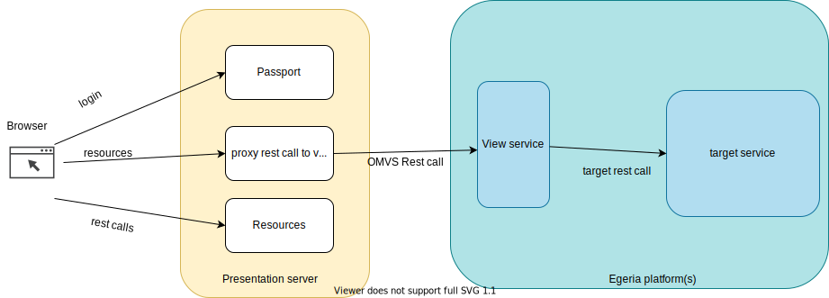

<!-- SPDX-License-Identifier: CC-BY-4.0 -->
<!-- Copyright Contributors to the ODPi Egeria project. -->
# Egeria Ecosystem (React) UI Planning

## UI capability types

There are 2 types of UI capabilities in the Presentation Server.

* **Ecosystem Tool** These are low level user exploration oriented user interfaces around resources, types and the operational landscape.
* **Solution** These are solution orientated user interfaces for particular personas.

Maybe this UI is for demonstrations, in which case you may want to configure all its capabilities. 
You may want to have a solutions orientated UI or an ecosystem tools oriented UI- as the users of each can be different in an organization. 

## UI capabilities

Here is a table showing for a UI capability, which view service it calls and which partner service the view service calls.
This information is important, so you can ensure that the appropriate view services and target services are configured to allow the UI
capability to work.

| UI Capability                                | UI Capability type |View Service | Partner service                    | Description                                                                         |
|----------------------------------------------| ----------- | ------ |------------------------------------|-------------------------------------------------------------------------------------|
| Type Explorer (Tex)                          | Ecosystem Tool | tex | OMRS                               | Exploration of the Egeria Type system loaded on server(s)                           
| Repository Explorer (Rex)                    | Ecosystem Tool | rex | OMRS                               | Exploration of OMRS entities and relationships present on server(s)                 
| Dynamic Infrastructure and Operations (Dino) | Ecosystem Tool |dino | OMRS                               | Exploration of the operation landscape                                              |
| Glossary Author                              | Solution | Glossary Author | Subject Area OMAS                  | Glossary author tasks, including Glossary Terms, Categories and their relationships |
| Server Author                                | Solution | Server Author | Admin server and platform services | Server author tasks including authoring new server configurations                   |

Planning your user interface means that you are choosing which UI capabilities to expose in the UI, which indicates which view services need to be 
configured and which partner services. 

## Architectural picture

Below is a picture of how the browser communicates with the presentation server (which is a node application). The presentation server handlers the login
using [passportjs](https://www.passportjs.org/) technology and the resources (html and images etc) as well as forwarding on the rest calls from the browser to the
view service.

The presentation server configuration is very simple; it uses environment variables to know where to issue its rest calls to.
More detailed information is configured in the view servers, using the standard OMAG server configuration.

## Planning checklist

- [ ] [Plan](/guides/planning/overview) your Egeria topology - including how many platforms, how many servers, cohort and connectors
- [ ] [Plan your UI](/user-interfaces/ecosystem/ecosystem-ui-planning) which UI capabilities you require.
- [ ] Start one (or more) OMAG Server Platforms either
    * locally using a development setup (where you compile the code and run it as a jar file)
    * Using a Kubernetes image
        * this can be using a coco image
        * a preconfigured simple image
        * an empty simple image
        * your own custom Kubernetes image
- [ ] [Configure the OMAG Server Platform](/guides/admin/configuring-the-omag-server-platform) if required (the Kubernetes image may have already configured an OMAG Server Platform)
- [ ] [Configure a Metadata Access Server](/guides/admin/servers/by-server-type/configuring-a-metadata-access-store) if required (the Kubernetes image may have configured a Metadata Access Server)
- [ ] [Configure a View Server](/guides/admin/servers/by-server-type/configuring-a-view-server)  for each of the UI capabilities you require. The name of the UI capability is the same as the name of the view service.
- [ ] [Configure and run the Presentation Server](/user-interfaces/ecosystem/configure-and-run-presentation-server)
- [ ] Validate that the presentation server is running as expected. Using the following guides:
    * [Repository explorer guide](/guides/ecosystem-ui/rex-user-guide)
    * [Type explorer guide](/guides/ecosystem-ui/tex-user-guide)
    * [Dino guide](/guides/ecosystem-ui/dino-user-guide)
    * [Glossary Author guide](/guides/ecosystem-ui/glossary-author-user-guide)
    * [Server Author guide](/guides/ecosystem-ui/server-author-user-guide)

--8<-- "snippets/abbr.md"

