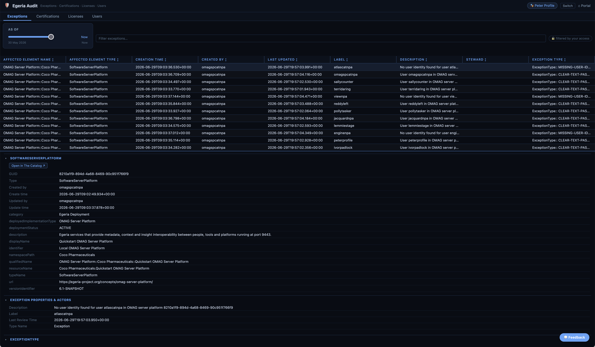

---
hide:
- toc
---

<!-- SPDX-License-Identifier: CC-BY-4.0 -->
<!-- Copyright Contributors to the Egeria project. -->

# Egeria Audit

**Egeria Audit** is a user interface for checking the status of exceptions, certifications, licenses and users. It is accessed from Egeria's portal. 

--8<-- "snippets/abbr.md"