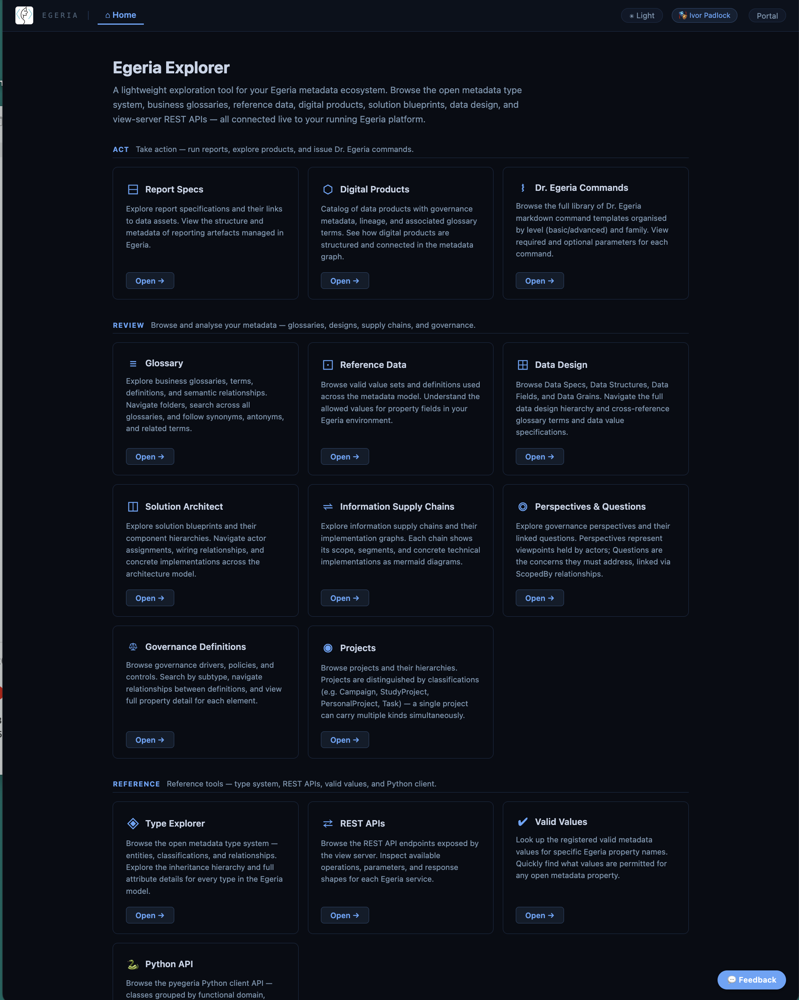
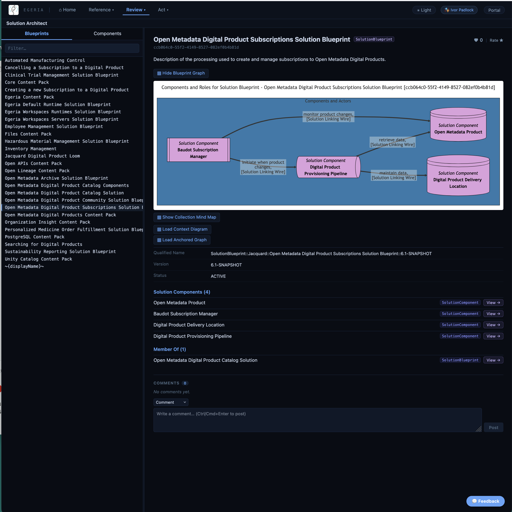
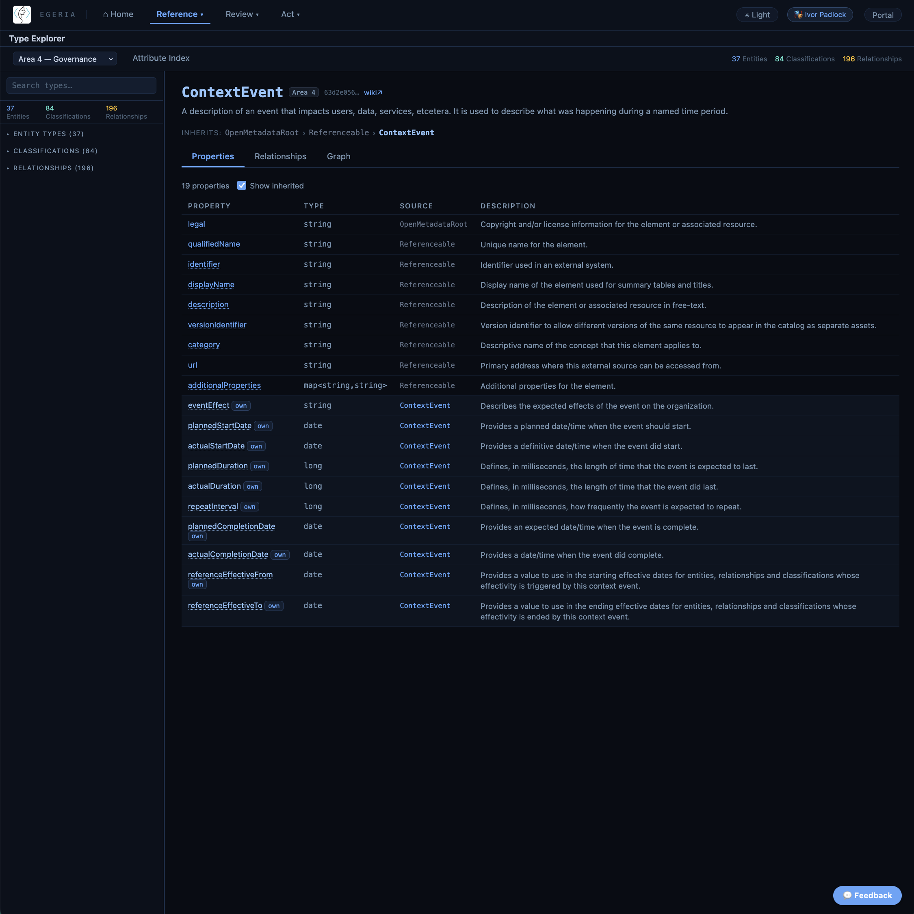
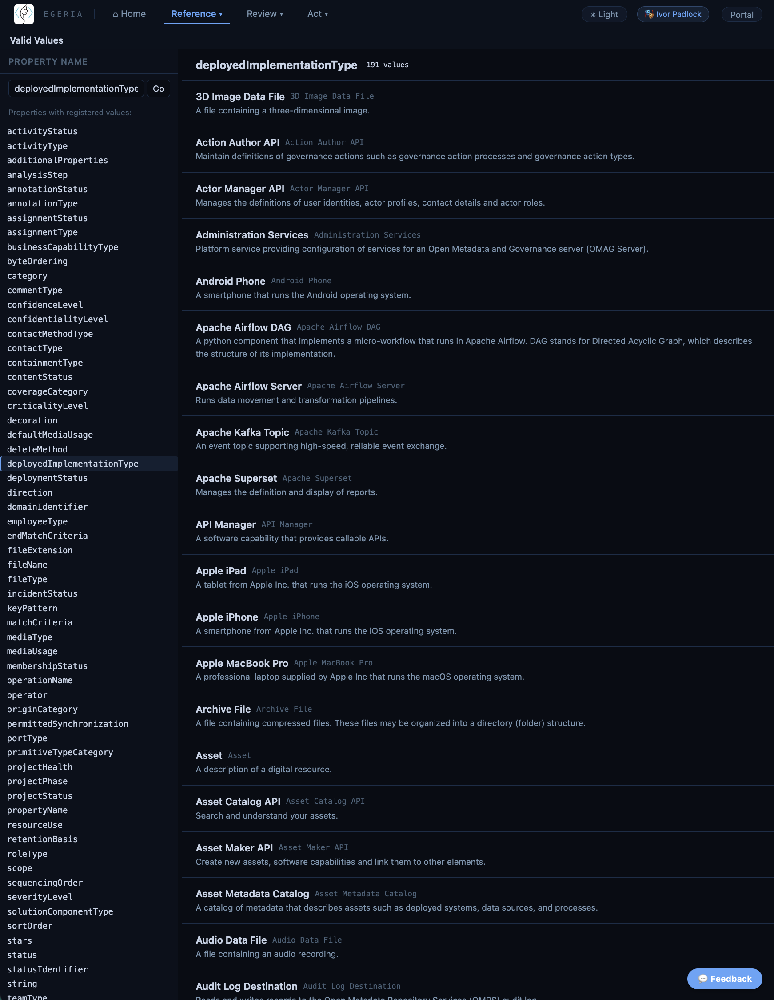

---
hide:
- toc
---

<!-- SPDX-License-Identifier: CC-BY-4.0 -->
<!-- Copyright Contributors to the Egeria project. -->

# Egeria Explorer

**Egeria Explorer** is a user interface for exploring open metadata.  It provides a navigable view of the open metadata knowledge graph, and allows users to browse and search for the detail they need.

This is the home page for Egeria Exploere.  Each tile is an entry point into Egeria's knowledge graph.

> This is the home page showing the different entry points into Egeria's knowldege graph.

Once you select a tile, the list of matching elements is displayed.  You can filter the list or select an element to see its detail.

> This is the detail page for a specific element.

On the detail page it is possible to see the properties of the element, its mermaid graphs, and the lists of relationships to other elements.  There are buttons and links to navigate to related elements.

Egeria Explorer also provides access to reference information. For example, the **Type Explorer** tile takes you to a navigable view of the open metadata type system that acts as the schema of the open metadata knowledge graph. 

> This is the detail page for a type definition.

The **Valid Values** tile lists the valid value sets for open metadata properties.  

> This is the detail page for a valid value.  It is for *deployedImplementationType which identifies the different types of technology recognised by Egeria.

--8<-- "snippets/work-in-progress.md"

--8<-- "snippets/abbr.md"