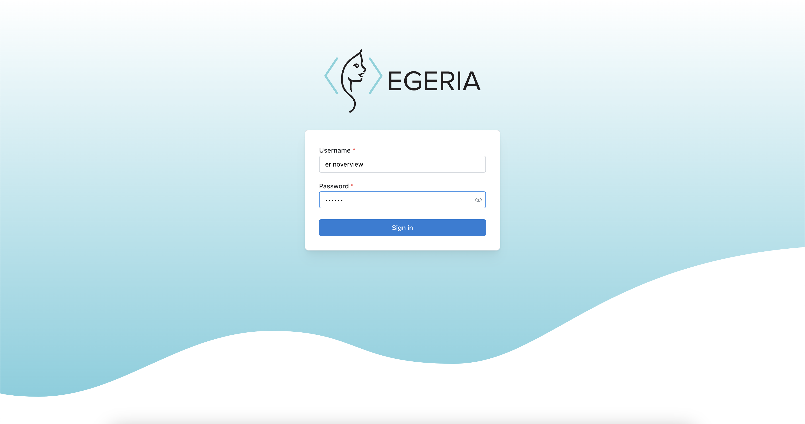
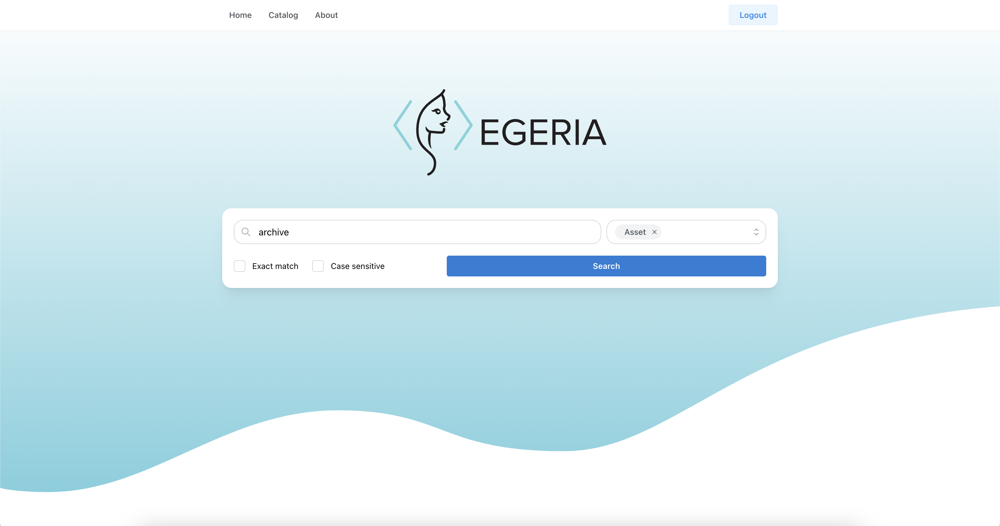
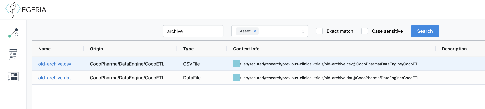
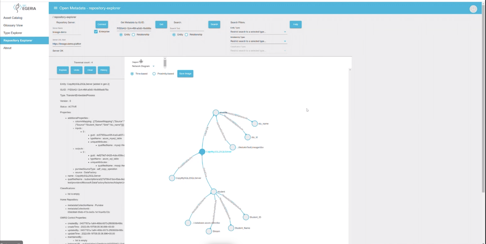

<!-- SPDX-License-Identifier: CC-BY-4.0 -->
<!-- Copyright Contributors to the Egeria project. -->

# Egeria General User Interface

Egeria's General User Interface provides a search function, the ability to view assets and glossaries and lineage.

After logging on, the home page offers the ability to enter search terms and select the type of metadata to search for.

The results are displayed in a list. 

New search phrases can be added to refine the search.

It is possible to view details of an asset returned by the search.

Selecting the *End2End* button, shows the lineage of the asset.

## Extended features

It is possible to configure some experimental features into the user interface through the role definitions.

* Repository Explorer (REX)
* Type Explorer (TEX)
* Glossary Viewer

## Setting up the General User Interface

* [Set up the UI server](https://github.com/odpi/egeria/tree/main/open-metadata-implementation/user-interfaces/ui-chassis)
* [Set up the UI client](https://github.com/odpi/egeria-ui)

--8<-- "snippets/abbr.md"
