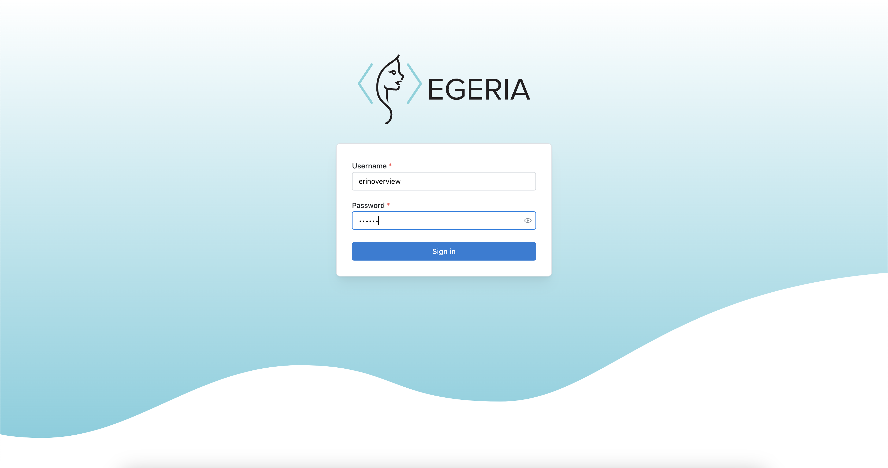
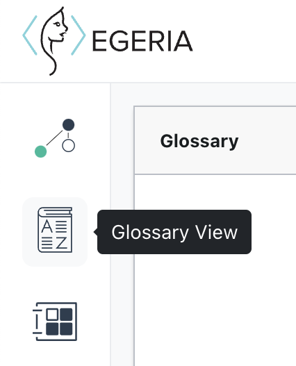
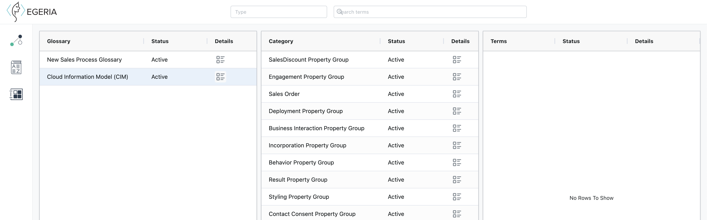

<!-- SPDX-License-Identifier: CC-BY-4.0 -->
<!-- Copyright Contributors to the Egeria project. -->

# Egeria General User Interface

Egeria's General User Interface provides a search function, and offers the ability to view *assets*, *glossaries* and *lineage*.

After logging on, you end up on the landing page. This shows a search bar where you can enter search terms and select the type of metadata to search for. There are two checkboxes which can be ticked to search for an `exact match` and to turn on `case sensitivity`.

At the top of the page are shortcuts to the **Asset catalog**, the **Glossary viewer** and the **About** page, as well as the **Logout** button.

## Asset Catalog

The results of the search are displayed in the *asset catalog*, in the form of a list of the assets. Changes can still be made to the search options to change the results.

The following attributes are present and possible to filter/order on:

- **Name**: Name of the asset.
- **Origin**: Origin of the metadata asset, in most cases it is the name of the metadata catalog.
- **Type**: Asset type.
- **Context info**: Information used to uniquely identify an asset, this is usually representation of its fully qualified name.
- **Description**: Text description of the asset. In our example this field is empty for both results.

By clicking on an asset's name, the details of this asset can be viewed. It is possible to print and/or save these details by clicking the **Print** button.

## Lineage Graph Viewer

Clicking on one of the lineage buttons (**end-to-end**, **ultimate-source** or **ultimate-destination**) on the details page shows that type of lineage of the asset, in a customizable graph.

The lineage graph that is shown has multiple action buttons that can influence what data is shown and how:

- **Zoom in**: To zoom in on the graph.
- **Zoom out**: To zoom out on the graph.
- **Fit to screen**: If you resize the graph or your browser, this button will reset the graph to fit within the screen.
- **Full screen**: This will get rid of the top bar with the different lineage types to offer more space for the graph.
- **Statistics**: A small pop-up will show statistics on the asset types in the graph, and the times they occur.
- **List of relationships**: A small pop-up will show the beginning and ending assets and the mapping between them.
- **Print**: This button will open the print dialogue to print and/or save the graph as a whole.
- **Processes**: This toggle will show assets of type process when turned on, but will condense the results to not show these when turned off.
- **Legend:** This toggle either shows or hides the legend that explains the entity types' icons.

## Glossary Viewer

The glossary viewer shows the glossaries that are available in the metadata repository and the information they contain. It is accessed through the action bar on the left of the screen.

On first load, the glossary is only able to show a list of available glossaries with their name and status. The glossary itself is organized into a hierarchy of *glossary categories* and *glossary terms*.

When clicking the `Details` button in third column of the glossary table, the categories connected to this respective glossary will be loaded.
The properties of these categories are displayed in the same way as the glossaries; their name and status are visible and another `Details` button is available.

Clicking this `Details` button will show the terms associated with its respective category. Each term in this case describes a concept or phrase used in the a data model, and its `Details` button will redirect to the same `asset details` page as from the asset catalog.

## Extended features

It is possible to configure some experimental features into the user interface through the role definitions.

- Repository Explorer (REX)
- Type Explorer (TEX)

## Setting up the General User Interface

* [Set up the UI server](https://github.com/odpi/egeria/tree/main/open-metadata-implementation/user-interfaces/ui-chassis)
* [Set up the UI client](https://github.com/odpi/egeria-ui)

--8<-- "snippets/abbr.md"
