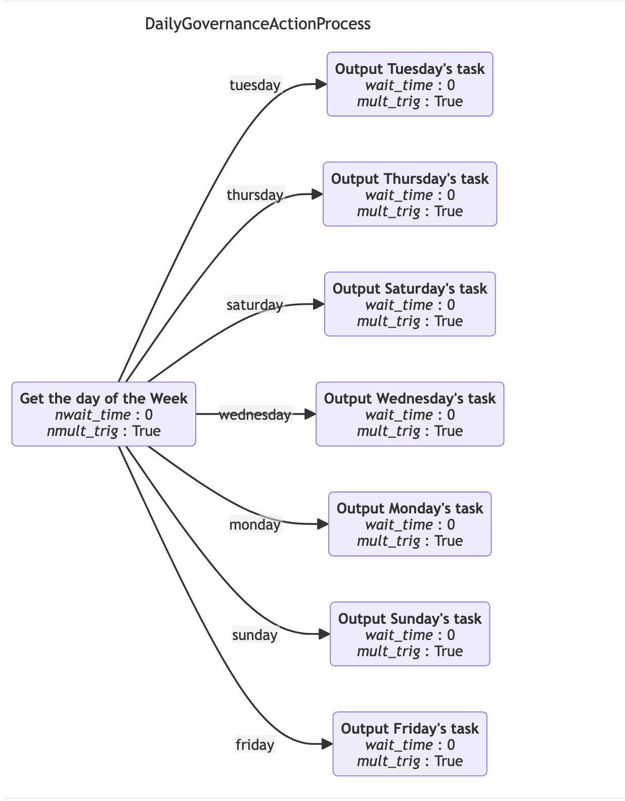

<!-- SPDX-License-Identifier: CC-BY-4.0 -->
<!-- Copyright Contributors to the Egeria project. -->

# Mermaid diagrams

[Mermaid](https://mermaid.js.org/) is a markdown extension for representing diagram using structured text that can then be rendered in a JavaScript environment.  Selected [Open Metadata View Services (OMVSs)](/services/omvs) return a Mermaid markdown string that can be used to render a visual representation of the elements returned on the same request.  This markdown can be rendered in a JavaScript environment that supports the Mermaid markdown, such as [JupyterLab Notebooks](#jupyterlab-notebooks) and [Draw.io](#drawio).

## Asset graphs

[Asset Catalog OMVS](/services/omvs/asset-catalog/overview) supports a REST API called *getAssetGraph(assetGUID)* which returns a graph of metadata elements that begins with the requested asset, and includes all the elements anchored to it, along with all the relationships that are attached to the requested asset and all its anchored elements.  In addition it returns a Mermaid string that can be used to visualise this structure.  Below is a screen capture of a rendered asset.


The asset is on the far left-hand side. Each box on the graph is a metadata element in the open metadata repository.  The test in *italics* is the element's type, and the text below is the elements display name. If the box has rounded corners, it is anchored to the starting asset.  If it has square corners, it is an element that is just linked to the one of the anchored elements.  The lines between the boxes represent relationships in the open metadata repository.  The label on the lines is the relationship type.  The arrow-head is at end 2 of the relationship.  Details of the types show on the diagram can be found on the [Open Metadata Types](/types) pages.

??? education "Implementation details"
    The Mermaid graph above is rendered from this string:

    ```
    "---\ntitle: Asset - view-server [5ae81670-0710-45b7-94bf-6337871b7dc1]\n---\nflowchart LR\n%%{init: {\"flowchart\": {\"htmlLabels\": false}} }%%\n\nViewServer:view-server(\"`*SoftwareServer*\n**view-server**`\")\nViewServer:view-server:SecretStoreEndpoint(\"`*Endpoint*\n**view-server secret store endpoint**`\")\nViewServer:view-server:SecretsStoreConnection(\"`*Connection*\n**view-server secrets store connection**`\")\nViewServer:view-server:Endpoint(\"`*Endpoint*\n**view-server endpoint**`\")\nViewServer:view-server:OpenMetadataandGovernanceEndUserAPIs(\"`*APIManager*\n**Open Metadata and Governance End User APIs**`\")\nViewServer:view-server:Connection(\"`*VirtualConnection*\n**view-server connection**`\")\nViewServer:view-server-->|SupportedSoftwareCapability|ViewServer:view-server:OpenMetadataandGovernanceEndUserAPIs\nViewServer:view-server:SecretsStoreConnection-->|ConnectionConnectorType|Egeria:SecretsStoreConnector:YAMLFile\nViewServer:view-server:Connection-->|ConnectionToAsset|ViewServer:view-server\nViewServer:view-server-->|ServerEndpoint|ViewServer:view-server:Endpoint\nViewServer:view-server:Connection-->|EmbeddedConnection|ViewServer:view-server:SecretsStoreConnection\nViewServer:view-server-->|SourcedFrom|ViewServer:serverName\nViewServer:view-server-->|DeployedOn|OMAGServerPlatform:DefaultLocalOMAGServerPlatform\nViewServer:view-server:Endpoint-->|ConnectionEndpoint|ViewServer:view-server:Connection\nViewServer:view-server:Connection-->|ConnectionConnectorType|Egeria:ResourceConnector:System:ViewServer\nViewServer:view-server:SecretStoreEndpoint-->|ConnectionEndpoint|ViewServer:view-server:SecretsStoreConnection\n"
    ```
    which is returned in the getAssetGraph() response like this(go to end):
    ```json
    {
      "class": "AssetGraphResponse",
      "relatedHTTPCode": 200,
      "assetGraph": {
        "properties": {
          "class": "AssetProperties",
          "typeName": "SoftwareServer",
          "qualifiedName": "View Server:view-server",
          "displayName": "view-server",
          "displayDescription": "A server that supplies REST API endpoints for User Interfaces and non-Java environments such as Python.",
          "name": "view-server",
          "resourceName": "view-server",
          "versionIdentifier": "Egeria OMAG Server Platform (version 5.2-SNAPSHOT)\n",
          "resourceDescription": "A server that supplies REST API endpoints for User Interfaces and non-Java environments such as Python.",
          "deployedImplementationType": "View Server"
        },
        "elementHeader": {
        },
        "anchoredElements": [...],
        "relationships":[...],
        "mermaidGraph": "---\ntitle: Asset - view-server [5ae81670-0710-45b7-94bf-6337871b7dc1]\n---\nflowchart LR\n%%{init: {\"flowchart\": {\"htmlLabels\": false}} }%%\n\nViewServer:view-server(\"`*SoftwareServer*\n**view-server**`\")\nViewServer:view-server:SecretStoreEndpoint(\"`*Endpoint*\n**view-server secret store endpoint**`\")\nViewServer:view-server:SecretsStoreConnection(\"`*Connection*\n**view-server secrets store connection**`\")\nViewServer:view-server:Endpoint(\"`*Endpoint*\n**view-server endpoint**`\")\nViewServer:view-server:OpenMetadataandGovernanceEndUserAPIs(\"`*APIManager*\n**Open Metadata and Governance End User APIs**`\")\nViewServer:view-server:Connection(\"`*VirtualConnection*\n**view-server connection**`\")\nViewServer:view-server-->|SupportedSoftwareCapability|ViewServer:view-server:OpenMetadataandGovernanceEndUserAPIs\nViewServer:view-server:SecretsStoreConnection-->|ConnectionConnectorType|Egeria:SecretsStoreConnector:YAMLFile\nViewServer:view-server:Connection-->|ConnectionToAsset|ViewServer:view-server\nViewServer:view-server-->|ServerEndpoint|ViewServer:view-server:Endpoint\nViewServer:view-server:Connection-->|EmbeddedConnection|ViewServer:view-server:SecretsStoreConnection\nViewServer:view-server-->|SourcedFrom|ViewServer:serverName\nViewServer:view-server-->|DeployedOn|OMAGServerPlatform:DefaultLocalOMAGServerPlatform\nViewServer:view-server:Endpoint-->|ConnectionEndpoint|ViewServer:view-server:Connection\nViewServer:view-server:Connection-->|ConnectionConnectorType|Egeria:ResourceConnector:System:ViewServer\nViewServer:view-server:SecretStoreEndpoint-->|ConnectionEndpoint|ViewServer:view-server:SecretsStoreConnection\n"
      }
    }
    ```

## Governance Action Process graphs

[Governance Action Processes](/concepts/governance-action-process) describe a linked series of steps that run in an [engine host](/concepts/engine-host).  Their definition is maintained in the open metadata repositories.  In addition, when a governance action process runs, a [*GovernanceActionProcessInstance*](/type/4/0462-Governance-Action-Processes) element is created and linked to the [engine actions](/concepts/engine-action) that controls the execution of the process.  

The [Automated Curation OMVS](/services/omvs/automated-curation/overview) has a REST API called *getGovernanceActionProcessGraph(processGUID)*.  It can either be passed the unique identifier of a governance action process element, or a governance action process instance element.  The mermaid graph returned for these processes is as follows.  This first image shows the sample *DailyGovernanceActionProcess* which determines the day of the week and runs a specific task for that day.  Each box is a step in the process.  The relationships show possible links to the next step to run.  The label on the relationship shows which [guard](/concepts/guard) must be produced to cause the linked step to run.  The *wait_time* is the minutes to wait before running the step and *mult_trig* indicates whether the step can be triggered multiple times in the same process instance, or not.



The next image show a single execution of this process.  Notice that the shape is different because each time it runs, it only outputs a single task.


## Lineage graphs

*Work in progress*

## Rendering mermaid diagrams

Mermaid is a mature standard that has widespread support.  Below are some examples of where it can be used.

### JupyterLab Notebooks

If you are using *JupyterLab Notebooks* with [pyegeria](user-interfaces/python-widgets/overview/#installation) installed, such as with the [egeria-workspaces](https://github.com/odpi/egeria-workspaces), it is possible to render Mermaid strings using the `render_mermaid(mermaid_string)` function call.

### Draw.io

The *draw.io* diagramming tool used extensively in this site can render Mermaid diagrams.  It is described in the [draw.io help](https://www.drawio.com/blog/mermaid-diagrams).

--8<-- "snippets/abbr.md"