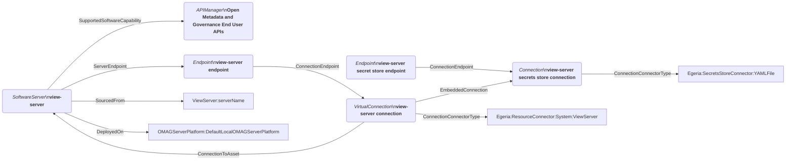
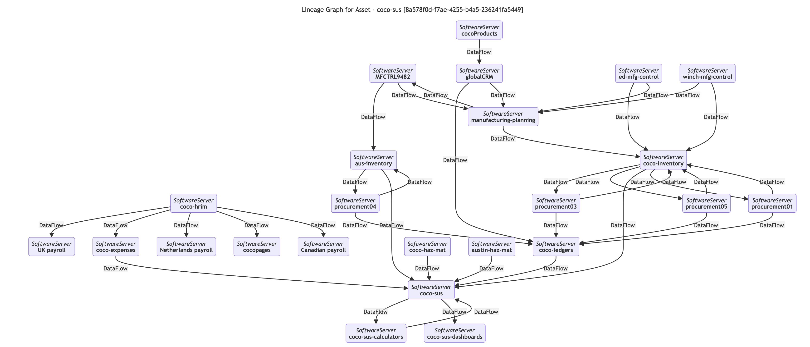
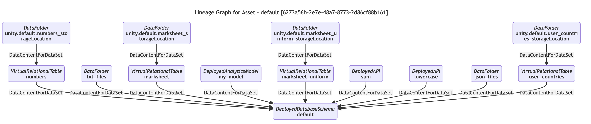
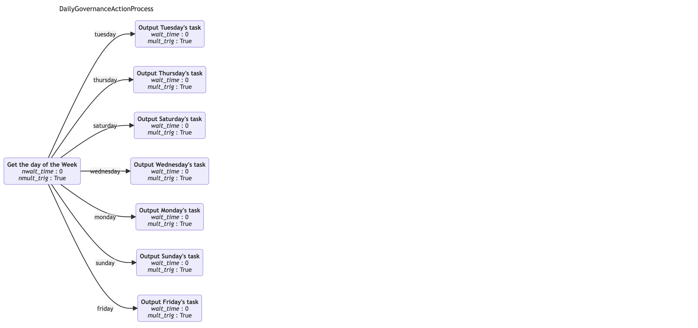
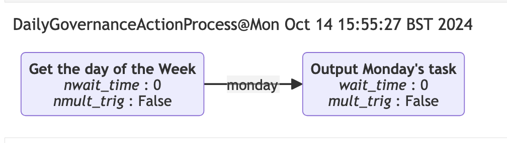

<!-- SPDX-License-Identifier: CC-BY-4.0 -->
<!-- Copyright Contributors to the Egeria project. -->

# Graph Visualization

Egeria visualizes collections of related metadata elements as graphs using Mermaid.
[Mermaid](https://mermaid.js.org/) is a markdown extension for representing diagram using structured text that can then be rendered in a JavaScript environment.  Selected [Open Metadata View Services (OMVSs)](/services/omvs) REST API calls return a Mermaid markdown string that can be used to render a visual representation of the elements returned on the same request.  


## Asset graphs

[Asset Catalog OMVS](/services/omvs/asset-catalog/overview) supports a REST API called *getAssetGraph(assetGUID)* which returns a graph of metadata elements that begins with the requested asset, and includes all the elements anchored to it, along with all the relationships that are attached to the requested asset and all its anchored elements.  In addition it returns a Mermaid string that can be used to visualise this structure.  Below is a screen capture of a rendered asset.



The asset is on the far left-hand side. Each box on the graph is a metadata element in the open metadata repository.  The text in *italics* is the element's type, and the text below is the element's display name. If the box has rounded corners, it is anchored to the starting asset.  If it has square corners, it is an element that is just linked to one of the anchored elements.  The lines between the boxes represent relationships in the open metadata repository.  The label on the lines is the relationship type.  The arrow-head is at end 2 of the relationship.  Details of the types shown on the diagram can be found on the [Open Metadata Types](/types) pages.

??? education "Implementation details"
    The Mermaid graph above is rendered from this string:
    ```
    flowchart LR
        %%{init: {"flowchart\": {"htmlLabels\": false}} }%%
        ViewServer:view-server("`*SoftwareServer*\n**view-server**`")
        ViewServer:view-server:SecretStoreEndpoint("`*Endpoint*\n**view-server secret store endpoint**`")
        ViewServer:view-server:SecretsStoreConnection("`*Connection*\n**view-server secrets store connection**`")
        ViewServer:view-server:Endpoint("`*Endpoint*\n**view-server endpoint**`")
        ViewServer:view-server:OpenMetadataandGovernanceEndUserAPIs("`*APIManager*\n**Open Metadata and Governance End User APIs**`")
        ViewServer:view-server:Connection("`*VirtualConnection*\n**view-server connection**`")
        ViewServer:view-server-->|SupportedSoftwareCapability|ViewServer:view-server:OpenMetadataandGovernanceEndUserAPIs
        ViewServer:view-server:SecretsStoreConnection-->|ConnectionConnectorType|Egeria:SecretsStoreConnector:YAMLFile
        ViewServer:view-server:Connection-->|ConnectionToAsset|ViewServer:view-server
        ViewServer:view-server-->|ServerEndpoint|ViewServer:view-server:Endpoint
        ViewServer:view-server:Connection-->|EmbeddedConnection|ViewServer:view-server:SecretsStoreConnection
        ViewServer:view-server-->|SourcedFrom|ViewServer:serverName
        ViewServer:view-server-->|DeployedOn|OMAGServerPlatform:DefaultLocalOMAGServerPlatform
        ViewServer:view-server:Endpoint-->|ConnectionEndpoint|ViewServer:view-server:Connection
        ViewServer:view-server:Connection-->|ConnectionConnectorType|Egeria:ResourceConnector:System:ViewServer
        ViewServer:view-server:SecretStoreEndpoint-->|ConnectionEndpoint|ViewServer:view-server:SecretsStoreConnection
    ```

    which is returned in the getAssetGraph() response like this(go to end):

    ```json
    {
      "class": "AssetGraphResponse",
      "relatedHTTPCode": 200,
      "assetGraph": {
        "properties": {
          "class": "AssetProperties",
          "typeName": "SoftwareServer",
          "qualifiedName": "View Server:view-server",
          "displayName": "view-server",
          "displayDescription": "A server that supplies REST API endpoints for User Interfaces and non-Java environments such as Python.",
          "name": "view-server",
          "resourceName": "view-server",
          "versionIdentifier": "Egeria OMAG Server Platform (version 5.2-SNAPSHOT)\n",
          "resourceDescription": "A server that supplies REST API endpoints for User Interfaces and non-Java environments such as Python.",
          "deployedImplementationType": "View Server"
        },
        "elementHeader": {
        },
        "anchoredElements": [...],
        "relationships":[...],
        "mermaidGraph": "---\ntitle: Asset - view-server [5ae81670-0710-45b7-94bf-6337871b7dc1]\n---\nflowchart LR\n%%{init: {\"flowchart\": {\"htmlLabels\": false}} }%%\n\nViewServer:view-server(\"`*SoftwareServer*\n**view-server**`\")\nViewServer:view-server:SecretStoreEndpoint(\"`*Endpoint*\n**view-server secret store endpoint**`\")\nViewServer:view-server:SecretsStoreConnection(\"`*Connection*\n**view-server secrets store connection**`\")\nViewServer:view-server:Endpoint(\"`*Endpoint*\n**view-server endpoint**`\")\nViewServer:view-server:OpenMetadataandGovernanceEndUserAPIs(\"`*APIManager*\n**Open Metadata and Governance End User APIs**`\")\nViewServer:view-server:Connection(\"`*VirtualConnection*\n**view-server connection**`\")\nViewServer:view-server-->|SupportedSoftwareCapability|ViewServer:view-server:OpenMetadataandGovernanceEndUserAPIs\nViewServer:view-server:SecretsStoreConnection-->|ConnectionConnectorType|Egeria:SecretsStoreConnector:YAMLFile\nViewServer:view-server:Connection-->|ConnectionToAsset|ViewServer:view-server\nViewServer:view-server-->|ServerEndpoint|ViewServer:view-server:Endpoint\nViewServer:view-server:Connection-->|EmbeddedConnection|ViewServer:view-server:SecretsStoreConnection\nViewServer:view-server-->|SourcedFrom|ViewServer:serverName\nViewServer:view-server-->|DeployedOn|OMAGServerPlatform:DefaultLocalOMAGServerPlatform\nViewServer:view-server:Endpoint-->|ConnectionEndpoint|ViewServer:view-server:Connection\nViewServer:view-server:Connection-->|ConnectionConnectorType|Egeria:ResourceConnector:System:ViewServer\nViewServer:view-server:SecretStoreEndpoint-->|ConnectionEndpoint|ViewServer:view-server:SecretsStoreConnection\n"
      }
    }
    ```


## Lineage graphs

[Asset Catalog OMVS](/services/omvs/asset-catalog/overview) also supports a REST API called *getAssetLineageGraph(assetGUID)* which returns a graph of metadata elements that are linked via lineage relationships with the requested asset.  In addition it returns a Mermaid string that can be used to visualise this structure.  Below is a screen capture of a rendered lineage graph.



The graph above shows [DataFlow](/types/7/0750-Data-Passing) relationships between systems.  The next image shows a lineage graph of the data sources that make up the resources in a Unity Catalog schema.  It is showing [DataSetContent](/types/2/0210-Data-Stores) relationships.



The full list of relationships supported are:

* [DataFlow](/types/7/0750-Data-Passing) - how is data flowing
* [ProcessCall](/types/7/0750-Data-Passing) - which system is calling another
* [ControlFlow](/types/7/0750-Data-Passing) - how is control passed between processes that are under the control of a workflow manager
* [LineageMapping](/types/7/0770-Lineage_Mapping) - how do elements catalogued from different lineage systems relate to one another
* [DataSetContent](/types/2/0210-Data-Stores) - how are data sources combined to create a data set
* [DerivedSchemaTypeQueryTarget](/types/5/0512-Derived-Schema-Elements) - what are the queries used to create derived data fields and views

You can specify any number of these relationship type on the query.  If you specify no relationships, it searches for any of these relationships.

## Governance Action Process graphs

[Governance Action Processes](/concepts/governance-action-process) describe a linked series of steps that run in an [engine host](/concepts/engine-host).  Their definition is maintained in the open metadata repositories.  In addition, when a governance action process runs, a [*GovernanceActionProcessInstance*](/types/4/0462-Governance-Action-Processes) element is created and linked to the [engine actions](/concepts/engine-action) that controls the execution of the process.

The [Automated Curation OMVS](/services/omvs/automated-curation/overview) has a REST API called *getGovernanceActionProcessGraph(processGUID)*.  It can either be passed the unique identifier of a governance action process element, or a governance action process instance element.  The mermaid graph returned for these processes is as follows.  This first image shows the sample *DailyGovernanceActionProcess* which determines the day of the week and runs a specific task for that day.  Each box is a step in the process.  The relationships show possible links to the next step to run.  The label on the relationship shows which [guard](/concepts/guard) must be produced to cause the linked step to run.  The *wait_time* is the minutes to wait before running the step and *mult_trig* indicates whether the step can be triggered multiple times in the same process instance, or not.



The next image show a single execution of this process.  Notice that the shape is different because each time it runs, it only outputs a single task.



## Rendering mermaid diagrams

Mermaid is a mature standard that has widespread support.  Below are some examples of where it can be used.

### Jupyter Notebooks

If you are using *Jupyter Notebooks* with [pyegeria](user-interfaces/hey-egeria/overview/#installation) installed, such as with the [egeria-workspaces](https://github.com/odpi/egeria-workspaces), it is possible to render Mermaid strings using the `render_mermaid(mermaid_string)` function call.

### Draw.io

The *draw.io* diagramming tool used extensively in this site can render Mermaid diagrams.  It is described in the [draw.io help](https://www.drawio.com/blog/mermaid-diagrams).

### Mermaid live editor

The Mermaid community provide a web page where you can paste a mermaid string, and it will render it dynamically.  The live editor can be found at [https://mermaid.live/edit](https://mermaid.live/edit)

--8<-- "snippets/abbr.md"